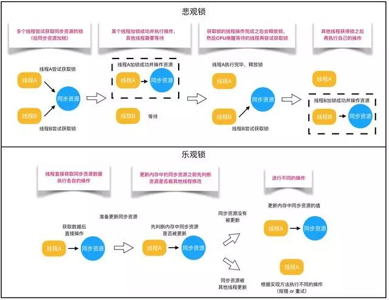
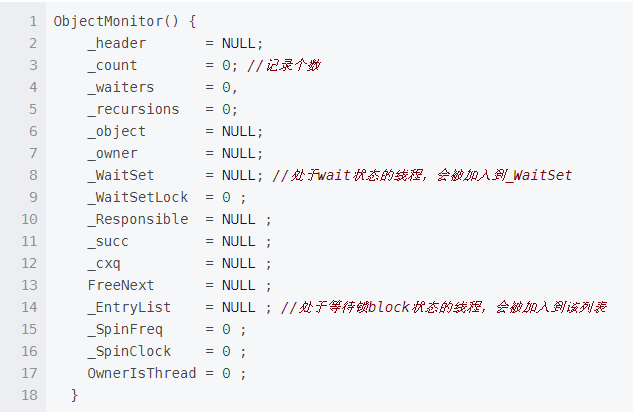
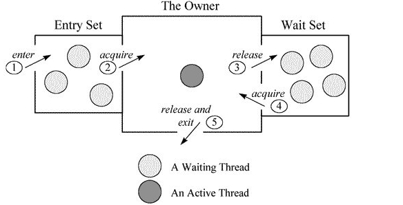
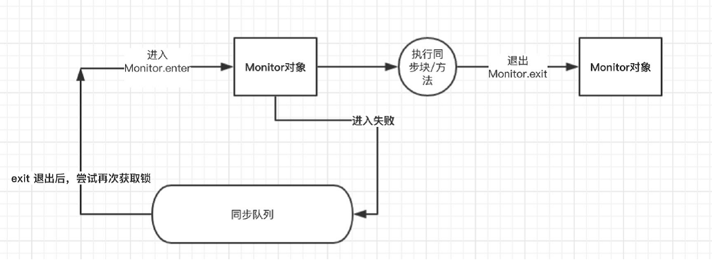
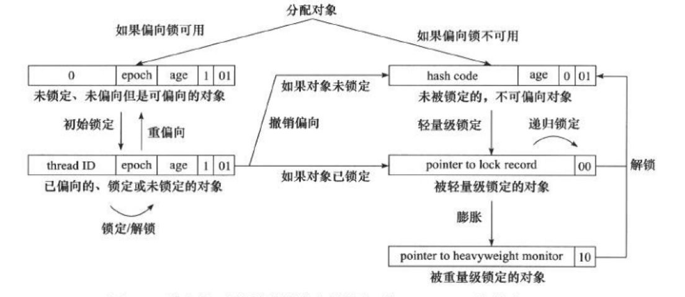
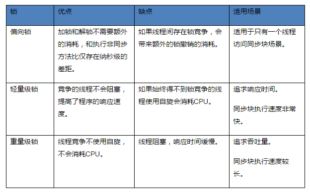

* [锁的基本概念](#%E9%94%81%E7%9A%84%E5%9F%BA%E6%9C%AC%E6%A6%82%E5%BF%B5)
  * [乐观锁 vs 悲观锁](#%E4%B9%90%E8%A7%82%E9%94%81-vs-%E6%82%B2%E8%A7%82%E9%94%81)
  * [公平锁 vs 非公平锁](#%E5%85%AC%E5%B9%B3%E9%94%81-vs-%E9%9D%9E%E5%85%AC%E5%B9%B3%E9%94%81)
  * [独享锁 vs 共享锁](#%E7%8B%AC%E4%BA%AB%E9%94%81-vs-%E5%85%B1%E4%BA%AB%E9%94%81)
  * [分段锁 vs 可重入锁](#%E5%88%86%E6%AE%B5%E9%94%81-vs-%E5%8F%AF%E9%87%8D%E5%85%A5%E9%94%81)
* [synchronized](#synchronized)
  * [对象头](#%E5%AF%B9%E8%B1%A1%E5%A4%B4)
  * [monitor](#monitor)
  * [synchronized底层原理](#synchronized%E5%BA%95%E5%B1%82%E5%8E%9F%E7%90%86)
  * [自旋锁/偏向锁/轻量级锁/重量级锁](#%E8%87%AA%E6%97%8B%E9%94%81%E5%81%8F%E5%90%91%E9%94%81%E8%BD%BB%E9%87%8F%E7%BA%A7%E9%94%81%E9%87%8D%E9%87%8F%E7%BA%A7%E9%94%81)
* [ReentrantLock](#reentrantlock)
  * [ReentrantLock](#reentrantlock-1)
  * [多个线程交替打印](#%E5%A4%9A%E4%B8%AA%E7%BA%BF%E7%A8%8B%E4%BA%A4%E6%9B%BF%E6%89%93%E5%8D%B0)
* [Volatile](#volatile)
  * [Volatile关键字的两层语义](#volatile%E5%85%B3%E9%94%AE%E5%AD%97%E7%9A%84%E4%B8%A4%E5%B1%82%E8%AF%AD%E4%B9%89)
  * [volatile的原理和实现机制](#volatile%E7%9A%84%E5%8E%9F%E7%90%86%E5%92%8C%E5%AE%9E%E7%8E%B0%E6%9C%BA%E5%88%B6)
  * [volatile关键字的使用场景](#volatile%E5%85%B3%E9%94%AE%E5%AD%97%E7%9A%84%E4%BD%BF%E7%94%A8%E5%9C%BA%E6%99%AF)


锁的基本概念
----------------

### 乐观锁 vs 悲观锁

**乐观锁**

使用乐观锁时，每次去拿数据的时候都认为别人不会修改，所以不会上锁，但是在更新的时候会判断一下在此期间别人有没有去更新这个数据，可以使用版本号等机制。

乐观锁**适用于多读**的应用类型，乐观锁在Java中是通过使用无锁编程来实现，最常采用的是**CAS算法**，java.util.concurrent包中的原子类中的递增操作就通过CAS自旋实现的。

**CAS全称 Compare And
Swap（比较与交换）**，是一种无锁算法。在不使用锁（没有线程被阻塞）的情况下实现多线程之间的变量同步。

简单来说，CAS算法有3个三个操作数：**需要读写的内存值 V、进行比较的值
A。要写入的新值B**。

**当且仅当预期值A和内存值V相同时，将内存值V修改为B，否则返回V。**

**Java
8推出了一个新的类，LongAdder，他就是尝试使用分段CAS以及自动分段迁移的方式来大幅度提升多线程高并发执行CAS操作的性能！**



**悲观锁**

总是假设最坏的情况，每次去拿数据的时候都认为别人会修改，所以每次在拿数据的时候都**会先上锁**，这样别人想拿这个数据就会阻塞直到它拿到锁**。Java的同步synchronized关键字的实现就是典型的悲观锁。**

**综上：悲观锁适合写操作多的场景，先加锁可以保证写操作时数据正确。乐观锁适合读操作多的场景，不加锁的特点能够使其读操作的性能大幅提升。**

### 公平锁 vs 非公平锁

公平与非公平指的是线程获取锁的方式。公平模式下，线程在同步队列中通过 FIFO
的方式获取锁，每个线程最终都能获取锁。在非公平模式下，线程会通过“插队”的方式去抢占锁，抢不到的则进入同步队列进行排队。

公平模式下，可保证每个线程最终都能获得锁，但效率相对比较较低。非公平模式下，效率比较高，但可能会导致线程出现饥饿的情况。即一些线程迟迟得不到锁，每次即将到手的锁都有可能被其他线程抢了。**原因如下**：

在激烈竞争的情况下，非公平锁的性能高于公平锁的性能的一个原因是：在恢复一个被挂起的线程与该线程真正开始运行之间存在着严重的延迟。假设线程
A 持有一个锁，并且线程 B 请求这个锁。由于这个线程已经被线程 A 持有，因此 B
将被挂起。当 A 释放锁时，B 将被唤醒，因此会再次尝试获取锁。与此同时，如果 C
也请求这个锁，那么 C 很有可能会在 B
被完全唤醒前获得、使用以及释放这个锁。这样的情况时一种“双赢”的局面：B
获得锁的时刻并没有推迟，C 更早的获得了锁，并且吞吐量也获得了提高。


另一个可能的原因是公平锁线程切换次数要比非公平锁线程切换次数多得多，因此效率上要低一些。

综上：如果线程持锁时间短，则应使用非公平锁，可通过“插队”提升效率。如果线程持锁时间长，“插队”带来的效率提升可能会比较小，此时应使用公平锁。

### 独享锁 vs 共享锁

>独享锁（互斥锁是指该锁一次只能被一个线程所持有。

>共享锁（读写锁）是指该锁可被多个线程所持有。

对于Java
ReentrantLock而言，其是独享锁。但是对于Lock的另一个实现类ReadWriteLock，其读锁是共享锁，其写锁是独享锁。读锁的共享锁可保证并发读是非常高效的，读写，写读
，写写的过程是互斥的。

独享锁与共享锁也是通过AQS来实现的，通过实现不同的方法，来实现独享或者共享。

### 分段锁 vs 可重入锁

分段锁其实是一种锁的设计，并不是具体的一种锁，对于ConcurrentHashMap而言，其并发的实现就是通过分段锁的形式来实现高效的并发操作。

ConcurrentHashMap中的分段锁称为Segment，它即类似于HashMap的结构，即内部拥有一个Entry数组，数组中的每个元素又是一个链表；同时又是一个ReentrantLock（Segment继承了ReentrantLock)。

当需要put元素的时候，并不是对整个hashmap进行加锁，而是先通过hashcode来知道他要放在那一个分段中，然后对这个分段进行加锁，所以当多线程put的时候，只要不是放在一个分段中，就实现了真正的并行的插入。

但是，在统计size的时候，可就是获取hashmap全局信息的时候，就需要获取所有的分段锁才能统计。

分段锁的设计目的是细化锁的粒度，当操作不需要更新整个数组的时候，就仅仅针对数组中的一项进行加锁操作。

可重入锁又名递归锁，是指在同一个线程在外层方法获取锁的时候，在进入内层方法会自动获取锁。对于ReentrantLock和
Synchronized都是是一个可重入锁。可重入锁的一个好处是可一定程度避免死锁。

>注意：受保护资源和锁之间合理的关联关系应该是 N:1 的关系，也就是说可以用一把锁来保护多个资源，但是不能用多把锁来保护一个资源。
保护没有关联关系的多个资源可以用多个锁来实现，但是保护有关联关系的多个资源最好用相同的锁。

### 死锁

死锁是一组互相竞争资源的线程因互相等待，导致“永久”阻塞的现象。只有以下这四个条件都发生时才会出现死锁：
* 互斥，共享资源 X 和 Y 只能被一个线程占用
* 占有且等待，线程 T1 已经取得共享资源 X，在等待共享资源 Y 的时候，不释放共享资源 X
* 不可抢占，其他线程不能强行抢占线程 T1 占有的资源
* 循环等待，线程 T1 等待线程 T2 占有的资源，线程 T2 等待线程 T1 占有的资源，就是循环等待


反过来分析，也就是说只要我们破坏其中一个，就可以成功避免死锁的发生。其中，互斥这个条件我们没有办法破坏，因为我们用锁为的就是互斥。不过其他三个条件都是有办法破坏掉的：
* 对于“占用且等待”这个条件，我们可以一次性申请所有的资源，这样就不存在等待了
* 对于“不可抢占”这个条件，占用部分资源的线程进一步申请其他资源时，如果申请不到，可以主动释放它占有的资源，这样不可抢占这个条件就破坏掉了。
* 对于“循环等待”这个条件，可以靠按序申请资源来预防。所谓按序申请，是指资源是有线性顺序的，申请的时候可以先申请资源序号小的，再申请资源序号大的，这样线性化后自然就不存在循环了


synchronized
----------------

synrhronized关键字简洁、清晰、语义明确，其应用层的语义是可以把任何一个非null对象作为"锁"。synchronized关键字最主要有以下3种应用方式：

**修饰实例方法**，作用于当前实例加锁，进入同步代码前要获得当前实例的锁

**修饰静态方法**，作用于当前类对象加锁，进入同步代码前要获得当前类对象的锁

**修饰代码块**，指定加锁对象，对给定对象加锁，进入同步代码库前要获得给定对象的锁。

### 对象头

HotSpot虚拟机中，对象在内存中存储的布局可以分为三块区域：对象头（Header）、实例数据（Instance
Data）和对齐填充（Padding）。HotSpot虚拟机的对象头(Object Header)包括两部分信息:

第一部分"Mark Word": 用于存储对象自身的运行时数据，
如哈希码（HashCode）、GC分代年龄、锁状态标志、线程持有的锁、偏向线程ID、偏向时间戳等等.

第二部分"Klass
Pointer"：对象指向它的类的元数据的指针，虚拟机通过这个指针来确定这个对象是哪个类的实例。

32位的HotSpot虚拟机对象头存储结构如下：


### monitor 

每个对象都存在着一个 monitor（管程）
与之关联(monitor对象存在于每个Java对象的对象头中)，对象与其 monitor
之间的关系有存在多种实现方式，如monitor可以与对象一起创建销毁或当线程试图获取对象锁时自动生成，但当一个
monitor
被某个线程持有后，它便处于锁定状态。在Java虚拟机(HotSpot)中，monitor是由ObjectMonitor实现的，其主要数据结构如下（位于HotSpot虚拟机源码ObjectMonitor.hpp文件，C++实现的）：



ObjectMonitor中有两个队列，_WaitSet 和
\_EntryList，用来保存ObjectWaiter对象列表(每个等待锁的线程都会被封装成ObjectWaiter对象)，_owner指向持有ObjectMonitor对象的线程，当多个线程同时访问一段同步代码时，首先会进入
\_EntryList集合，当线程获取到对象的monitor 后进入 \_Owner
区域并把monitor中的owner变量设置为当前线程同时monitor中的计数器count加1，若线程调用
wait()
方法，将释放当前持有的monitor，owner变量恢复为null，count自减1，同时该线程进入
WaitSet集合中等待被唤醒。若当前线程执行完毕也将释放monitor(锁)并复位变量的值，以便其他线程进入获取monitor(锁)。如下图所示:



### synchronized底层原理

synchronized的实现离不开虚拟机JVM的支持，JVM是通过进入、退出对象监视器(monitor)来实现对方法、同步块的同步的。具体实现是在编译之后在同步方法调用前加入一个
monitor.enter 指令，在退出方法和异常处插入monitor.exit
的指令。其本质就是对一个对象监视器(Monitor)进行获取，而这个获取过程具有排他性从而达到了同一时刻只能一个线程访问的目的。而对于没有获取到锁的线程将会阻塞到方法入口处，直到获取锁的线程
monitor.exit之后才能尝试继续获取锁。流程图如下:



**具体来说：**

**对代码块同步**：synchronized每个对象有一个监视器锁（monitor)。当monitor被占用时就会处于锁定状态，线程执行monitorenter指令时尝试获取monitor的所有权，过程如下：

>1、如果monitor的进入数为0,则该线程进入monitor，然后将进入数设置为1，该线程即为monitor的所有者。

>2、如果线程己经占有该monitor，只是重新进入，则进入monitor的进入数加1。

>3、如果其他线程己经占用了
monitor，则该线程进入阻塞状态，直到monitor的进入数为0,再重新尝试获取monitor的所有权。

**同步方法**：调用指令将会检查方法的ACC_SYNCHR〇NIZED访问标志是否被设置，如果设置了，执行线程将先获取monitor，获取成功之后才能执行方法体，方法执行完后再释放

monitor。

### 自旋锁/偏向锁/轻量级锁/重量级锁

锁的状态总共有四种，无锁状态、偏向锁、轻量级锁和重量级锁(synchronized)。随着锁的竞争，锁可以从偏向锁升级到轻量级锁，再升级的重量级锁，但是锁的升级是单向的，也就是说只能从低到高升级，不会出现锁的降级。锁的状态是保存在**对象头中**。

**偏向锁目的**是消除数据在**由同一线程反复获得**的情况下的同步，即一段同步代码一直被一个线程所访问，那么该线程会自动获取锁。

偏向锁的核心思想是：如果一个线程获得了锁，那么锁就进入偏向模式，此时Mark Word
的结构也变为偏向锁结构，当这个线程再次请求锁时，无需再做任何同步操作，即获取锁的过程，这样就省去了大量有关锁申请的操作，从而也就提供程序的性能。所以，对于没有锁竞争的场合，偏向锁有很好的优化效果。**但是对于锁竞争比较激烈的场合，偏向锁就失效了**。偏向锁失败后，并不会立即膨胀为重量级锁，而是先升级为轻量级锁。

**加锁**：当线程访问同步块时，会使用 CAS 将线程ID 更新到锁对象的 Mark Word中，如果更新成功则获得偏向锁，并且之后每次进入这个对象锁相关的同步块时都不需要再次获取锁了。

**释放锁**：当有另外一个线程获取这个锁时，持有偏向锁的线程就会释放锁，释放时会等待全局安全点(这一时刻没有字节码运行)，接着会暂停拥有偏向锁的线程，根据锁对象目前是否被锁来判定将对象头中的Mark Word 设置为无锁或者是轻量锁状态。

**轻量级锁**是指当锁是偏向锁的时候，被另一个线程所访问，偏向锁就会升级为轻量级锁，其他线程会通过自旋的形式尝试获取锁，不会阻塞，提高性能。**轻量锁的特征是大多数锁在整个同步周期都不存在竞争，所以使用
CAS 比使用互斥开销更少**。但如果锁竞争激烈，轻量锁就不但有互斥的开销，还有 CAS
的开销，甚至比重量锁更慢。轻量级锁所适应的场景是线程交替执行同步块的场合，如果存在同一时间访问同一锁的场合，就会导致轻量级锁膨胀为重量级锁。

**加锁**：当代码进入同步块时，如果同步对象为无锁状态时，当前线程会在栈帧中创建一个锁记录(LockRecord)区域，同时将锁对象的对象头中 Mark Word 拷贝到锁记录中，再尝试使用 CAS 将Mark Word 更新为指向锁记录的指针。如果更新成功，当前线程就获得了锁。如果更新失败 JVM 会先检查锁对象的 Mark Word是否指向当前线程的锁记录。如果是则说明当前线程拥有锁对象的锁，可以直接进入同步块。不是则说明有其他线程抢占了锁，如果存在多个线程同时竞争一把锁，轻量锁就会膨胀为重量锁。

**解锁**：轻量锁的解锁过程也是利用 CAS 来实现的，会尝试锁记录替换回锁对象的 Mark Word。如果替换成功则说明整个同步操作完成，失败则说明有其他线程尝试获取锁，这时就会唤醒被挂起的线程(此时已经膨胀为重量锁)。



**自旋锁**：轻量级锁失败后，虚拟机为了避免线程真实地在操作系统层面挂起，还会进行一项称为自旋锁的优化手段。**这是基于在大多数情况下，线程持有锁的时间都不会太长，如果直接挂起操作系统层面的线程可能会得不偿失**，毕竟操作系统实现线程之间的切换时需要从用户态转换到核心态，这个状态之间的转换需要相对比较长的时间，时间成本相对较高，**因此自旋锁会假设在不久将来，当前的线程可以获得锁，**因此虚拟机会让当前想要获取锁的线程做几个空循环(这也是称为自旋的原因)，一般不会太久，可能是50个循环或100循环，在经过若干次循环后，如果得到锁，就顺利进入临界区。如果还不能获得锁，那就会将线程在操作系统层面挂起，这就是自旋锁的优化方式，这种方式确实也是可以提升效率的。最后没办法也就只能升级为重量级锁了。

自旋锁的好处是减少线程上下文切换的消耗，缺点是循环会消耗CPU。JDK1.6引入了自适应的自旋锁。它的基本原理是如果某个锁自旋很少成功获得，那么下一次就会减少自旋。如果自旋等待成功获取过锁，则会适当的延长获取锁的时间。

**不同锁的比较**



ReentrantLock
-----------------

###  ReentrantLock

ReentrantLock 是基于AQS实现的，AQS很好的封装了同步队列的管理，线程的阻塞与唤醒等基础操作。基于 AQS 的同步组件，ReentrantLock 中包含了一个静态抽象类Sync。

AQS维护了一个基于双向链表的同步队列，线程在获取同步状态失败的情况下，都会被封装成节点，然后加入队列中。同步队列大致示意图如下：


在同步队列中，头结点是获取同步状态的节点。其他节点在尝试获取同步状态失败后，会被阻塞住，暂停运行。当头结点释放同步状态后，会唤醒其后继节点。后继节点会将自己设为头节点，并将原头节点从队列中移除。

**公平锁的流程如下：**

**1、调用 acquire 方法，将线程放入同步队列中进行等待**

2、线程在同步队列中成功获取锁，则将自己设为持锁线程后返回

3、若同步状态不为0，且当前线程为持锁线程，则执行重入逻辑

**非公平锁步骤大致如下：**

1、调用compareAndSetState方法抢占式加锁，加锁成功则将自己设为持锁线程，并返回

2、若加锁失败，则调用 acquire 方法，将线程置于同步队列尾部进行等待

3、线程在同步队列中成功获取锁，则将自己设为持锁线程后返回

4、若同步状态不为0，且当前线程为持锁线程，则执行重入逻辑

[具体源码参考](http://www.cnblogs.com/nullllun/p/9004309.html#autoid-1-0-0)

**ReentrantLock 和 synchronized 区别**


### 多个线程交替打印

```
import java.util.concurrent.locks.Lock;
import java.util.concurrent.locks.ReentrantLock;

// 多个线程交替打印
// 以三个为例
public class Print {

    private int start;
    private int end;
    private int num= 3;  //线程的数量

    // 对 flag 的写入虽然加锁保证了线程安全，但读取的时候由于 不是 volatile 所以可能会读取到旧值
    private volatile int flag = 0; //表明是哪个线程执行
    //定义一个充入锁
    private final static Lock LOCK = new ReentrantLock();

    public Print(int start,int end,int num){
        this.start = start;
        this.end = end;
        this.num = num;
    }

    public static void main(String[] args) {

        Print p = new Print(1,15,3);
        for(int i=0;i<p.num;i++)
            new Thread(new subThread(p,i)).start();

    }

    public static class subThread implements Runnable{

        private Print print;
        private int name;

        public subThread(Print print,int name) {
            this.print = print;
            this.name = name;
        }

        @Override
        public void run() {
            while(print.start <= print.end){
                if(print.flag == name){
                    try{
                        LOCK.lock();
                        System.out.println("Thread" + name + ":  "+print.start);
                        print.start++;
                        print.flag = (print.flag + 1) % print.num;

                    }finally {
                        LOCK.unlock();
                    }
                }

            }
        }
    }
}

```

Volatile
------------

### Volatile关键字的两层语义

一旦一个共享变量（类的成员变量、类的静态成员变量）被volatile修饰之后，那么就具备了两层语义：

**语义一：保证了不同线程对这个变量进行操作时的可见性，即一个线程修改了某个变量的值，这新值对其他线程来说是立即可见的。**

每个线程在运行过程中都有自己的工作内存，以两个线程共享一个用volatile修饰的变量为例：

第一：使用volatile关键字会强制将修改的值**立即写入主存**。

第二：使用volatile关键字的话，当线程2进行修改时，会导致线程1的工作内存中缓存变量stop的缓存行无效（反映到硬件层的话，就是CPU的L1或者L2缓存中对应的缓存行无效）。

第三：由于线程1的工作内存中缓存变量的缓存行无效，所以线程1再次读取该变量的值时会去主存读取。那么线程1读取到的就是最新的正确的值。

**语义二：禁止进行指令重排序。volatile关键字禁止指令重排序有两层意思：**

第一：当程序执行到volatile变量的读操作或者写操作时，在其前面的操作的更改肯定全部已经进行，且结果已经对后面的操作可见，在其后面的操作肯定还没有进行。

第二：在进行指令优化时，不能将在对volatile变量访问的语句放在其后面执行，也不能把volatile变量后面的语句放到其前面执行。

###  volatile的原理和实现机制

观察加入volatile关键字和没有加入volatile关键字时所生成的汇编代码发现，加入volatile关键字时，会多出一个**lock前缀指令**---深入理解Java虚拟机。

**lock前缀指令实际上相当于一个内存屏障**（也成内存栅栏），内存屏障会提供3个功能：

1.它确保指令重排序时不会把其后面的指令排到内存屏障之前的位置，也不会把前面的指令排到内存屏障的后面；即在执行到内存屏障这句指令时，在它前面的操作已经全部完成。

2.它会强制将对缓存的修改操作立即写入主存。

3.如果是写操作，它会导致其他CPU中对应的缓存行无效。

### volatile关键字的使用场景

synchronized关键字是防止多个线程同时执行一段代码，那么就会很影响程序执行效率，而volatile关键字在某些情况下性能要优于synchronized，但是要注意**volatile关键字是无法替代synchronized关键字的，因为volatile关键字无法保证操作的原子性**（volatile可以保证可见性，可见性只能保证每次读取的是最新的值，但是volatile没办法保证对变量的操作的原子性）。通常来说，使用volatile必须具备以下2个条件：

1.对变量的写操作不依赖于当前值

2.该变量没有包含在具有其他变量的不变式中。

具体来说：1.状态标记量，2.double check。
