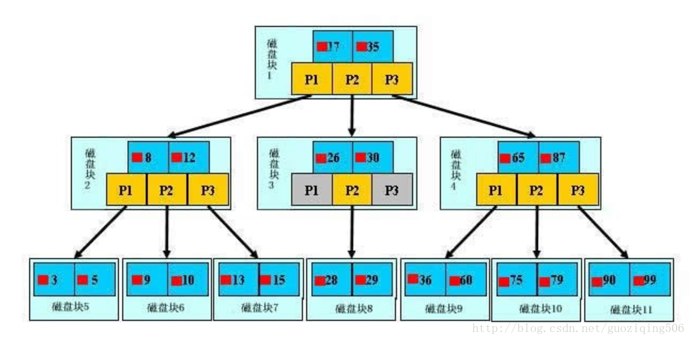
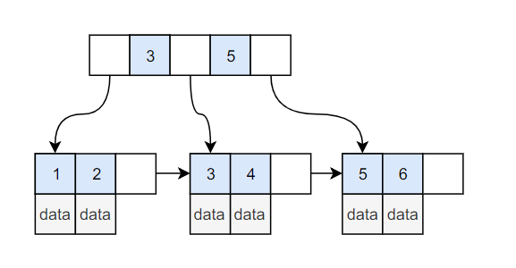
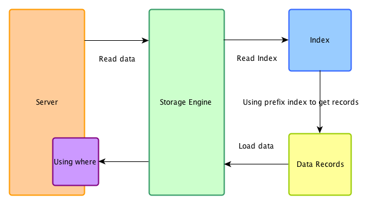
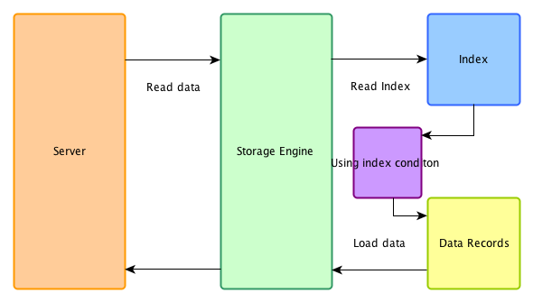
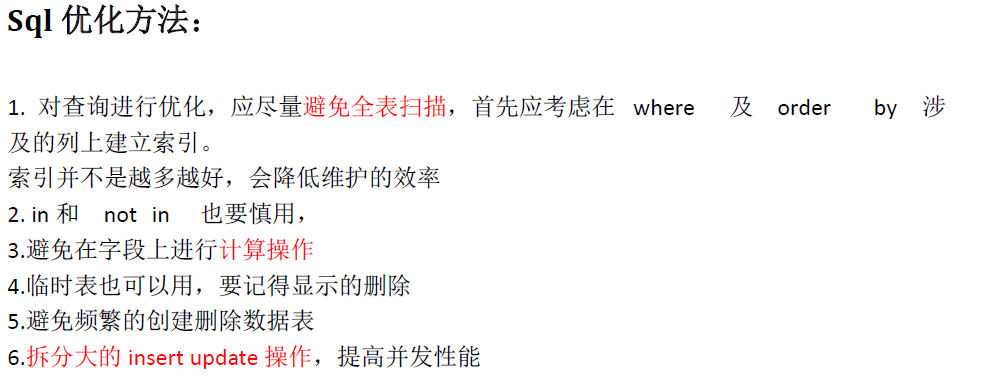
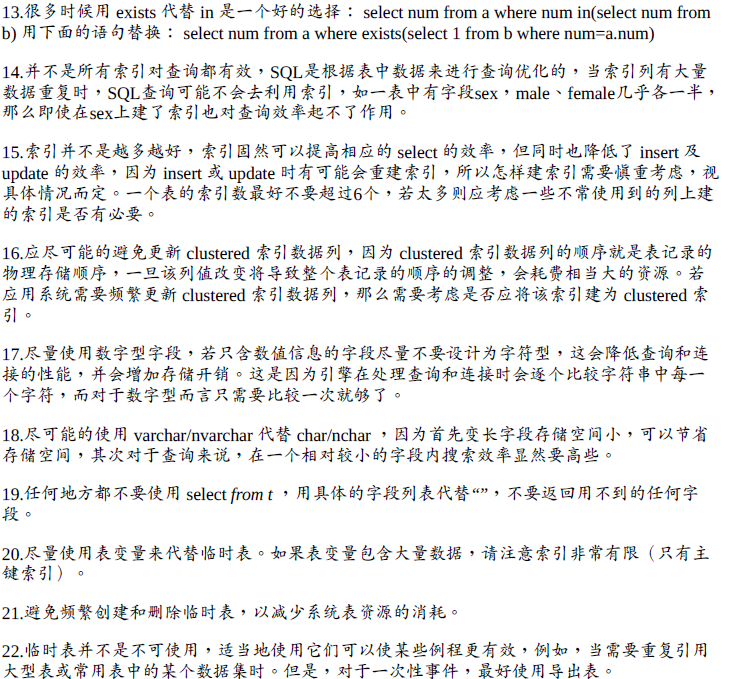
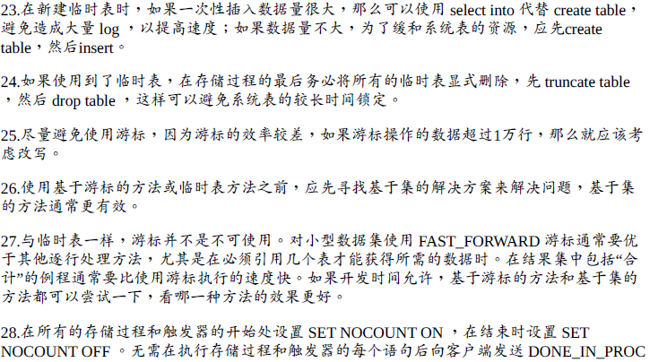
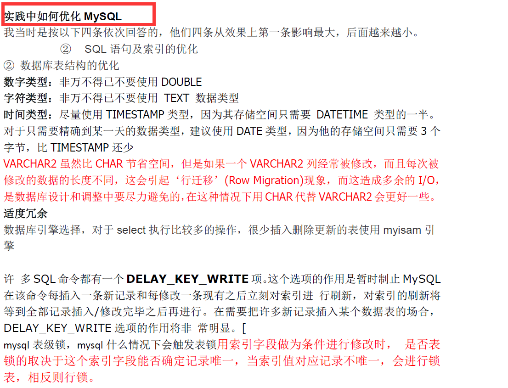

* [索引](#%E7%B4%A2%E5%BC%95)
  * [索引背后的数据结构](#%E7%B4%A2%E5%BC%95%E8%83%8C%E5%90%8E%E7%9A%84%E6%95%B0%E6%8D%AE%E7%BB%93%E6%9E%84)
    * [B树](#b%E6%A0%91)
    * [B\+树](#b%E6%A0%91-1)
    * [什么是B\+ Tree](#%E4%BB%80%E4%B9%88%E6%98%AFb-tree)
  * [索引分类](#%E7%B4%A2%E5%BC%95%E5%88%86%E7%B1%BB)
    * [B\+Tree 索引](#btree-%E7%B4%A2%E5%BC%95)
    * [哈希索引](#%E5%93%88%E5%B8%8C%E7%B4%A2%E5%BC%95)
    * [全文索引](#%E5%85%A8%E6%96%87%E7%B4%A2%E5%BC%95)
    * [空间数据索引（R\-Tree）](#%E7%A9%BA%E9%97%B4%E6%95%B0%E6%8D%AE%E7%B4%A2%E5%BC%95r-tree)
    * [索引的优点](#%E7%B4%A2%E5%BC%95%E7%9A%84%E4%BC%98%E7%82%B9)
    * [索引下推](#%E7%B4%A2%E5%BC%95%E4%B8%8B%E6%8E%A8)
* [InnoDB与MyISAM引擎区别](#innodb%E4%B8%8Emyisam%E5%BC%95%E6%93%8E%E5%8C%BA%E5%88%AB)
  * [MyISAM](#myisam)
  * [InnoDB](#innodb)
* [数据库特性](#%E6%95%B0%E6%8D%AE%E5%BA%93%E7%89%B9%E6%80%A7)
* [事务隔离级别](#%E4%BA%8B%E5%8A%A1%E9%9A%94%E7%A6%BB%E7%BA%A7%E5%88%AB)
  * [并发下事务会产生的问题](#%E5%B9%B6%E5%8F%91%E4%B8%8B%E4%BA%8B%E5%8A%A1%E4%BC%9A%E4%BA%A7%E7%94%9F%E7%9A%84%E9%97%AE%E9%A2%98)
  * [事务隔离级别](#%E4%BA%8B%E5%8A%A1%E9%9A%94%E7%A6%BB%E7%BA%A7%E5%88%AB-1)
* [SQL优化](#sql%E4%BC%98%E5%8C%96)
* [数据库范式](#%E6%95%B0%E6%8D%AE%E5%BA%93%E8%8C%83%E5%BC%8F)
* [数据库连接池](#%E6%95%B0%E6%8D%AE%E5%BA%93%E8%BF%9E%E6%8E%A5%E6%B1%A0)
  * [为什么会有数据库连接池](#%E4%B8%BA%E4%BB%80%E4%B9%88%E4%BC%9A%E6%9C%89%E6%95%B0%E6%8D%AE%E5%BA%93%E8%BF%9E%E6%8E%A5%E6%B1%A0)
  * [数据库连接池的实现](#%E6%95%B0%E6%8D%AE%E5%BA%93%E8%BF%9E%E6%8E%A5%E6%B1%A0%E7%9A%84%E5%AE%9E%E7%8E%B0)
  * [Explain](#explain)
  * [分库分表](#%E5%88%86%E5%BA%93%E5%88%86%E8%A1%A8)
* [其它问题](#%E5%85%B6%E5%AE%83%E9%97%AE%E9%A2%98)
  * [limit 20000 如何优化](#limit-20000-%E5%A6%82%E4%BD%95%E4%BC%98%E5%8C%96)
  * [隔离级别如何实现](#%E9%9A%94%E7%A6%BB%E7%BA%A7%E5%88%AB%E5%A6%82%E4%BD%95%E5%AE%9E%E7%8E%B0)
  * [drop delete truncate区别](#drop-delete-truncate%E5%8C%BA%E5%88%AB)
  * [超键、候选键、主键、外键 视图](#%E8%B6%85%E9%94%AE%E5%80%99%E9%80%89%E9%94%AE%E4%B8%BB%E9%94%AE%E5%A4%96%E9%94%AE-%E8%A7%86%E5%9B%BE)
  * [MVCC多版本并发控制](#mvcc%E5%A4%9A%E7%89%88%E6%9C%AC%E5%B9%B6%E5%8F%91%E6%8E%A7%E5%88%B6)
  * [SQL语句的5个连接概念](#sql%E8%AF%AD%E5%8F%A5%E7%9A%845%E4%B8%AA%E8%BF%9E%E6%8E%A5%E6%A6%82%E5%BF%B5)
  * [索引的最左前缀原则](#%E7%B4%A2%E5%BC%95%E7%9A%84%E6%9C%80%E5%B7%A6%E5%89%8D%E7%BC%80%E5%8E%9F%E5%88%99)
  * [跨库join](#%E8%B7%A8%E5%BA%93join)

索引
--------

**索引（Index）是帮助MySQL高效获取数据的数据结构。索引是在存储引擎层实现的，**

**而不是在服务器层实现的，所以不同存储引擎具有不同的索引类型和实现。**

### 索引背后的数据结构

#### B树

>   **B树又叫平衡多路查找树。**

>   B树的一个例子（小红方块表示对应关键字所代表的文件的存储位置，P是指向下一个磁盘块的指针）：  
>   

#### B+树

>   **B+tree是应文件系统所需而产生的一种Btree的变形树。**
B+树中所有的叶子结点中包含了全部关键字的信息，及指向含有这些关键字记录的指针，且叶子结点本身依关键字的大小自小而大的顺序链接。所有的非终端结点可以看成是索引部分，结点中仅含有其子树根结点中最大（或最小）关键字。

#### 什么是B+ Tree

>   红黑树等平衡树也可以用来实现索引，但是文件系统及数据库系统普遍采用 B+ Tree
>   作为索引结构，主要有以下两个原因：

>   **1、B+树的磁盘读写代价更低**

>   B+的内部结点并没有指向关键字具体信息的指针。因此其内部结点相对B树更小。如果把所有同一内部结点的关键字存放在同一盘块中，那么盘块所能容纳的关键字数量也越多。一次性读入内存中的需要查找的关键字也就越多。相对来说IO读写次数也就降低了。

>   **2、B+树的查询效率更加稳定**

>   由于非终结点并不是最终指向文件内容的结点，而只是叶子结点中关键字的索引。所以任何关键字的查找必须走一条从根结点到叶子结点的路。所有关键字查询的路径长度相同，导致每一个数据的查询效率相当。

>   **3、B+树更有利于对数据库的扫描**

>   B树在提高了磁盘IO性能的同时并没有解决元素遍历的效率低下的问题，而B+树只需要遍历叶子节点就可以解决对全部关键字信息的扫描，所以对于数据库中频繁使用的range
>   query，B+树有着更高的性能。

### 索引分类

####  B+Tree 索引

**B+Tree 索引是大多数 MySQL存储引擎的默认索引类型。**
因为不再需要进行全表扫描，只需要对树进行搜索即可，因此查找速度快很多。除了用于查找，还可以用于排序和分组。可以指定多个列作为索引列，多个索引列共同组成键。B+Tree索引适用于全键值、键值范围和键前缀查找，其中键前缀查找只适用于最左前缀查找。如果不是按照索引列的顺序进行查找，则无法使用索引。

**普通索引：**
最基本的索引类型，而且它没有唯一性之类的限制。

**UNIQUE索引：**
表示唯一的，不允许重复的索引，可以为NULL值，一个表可以有多个唯一索引。

**主键索引：**
主键是一种唯一性索引，不能为NULL值，只能有一个。

#### 哈希索引

InnoDB
引擎有一个特殊的功能叫**自适应哈希索引**
，当某个索引值被使用的非常频繁时，会在
B+Tree 索引之上再创建一个哈希索引，这样就让 B+Tree
索引具有哈希索引的一些优点，比如快速的哈希查找。哈希索引能以 O(1)
时间进行查找，但是失去了有序性，它具有以下限制：

* 无法用于排序与分组；
* 只支持精确查找，无法用于部分查找和范围查找；

#### 全文索引

**MyISAM
存储引擎支持全文索引，**
用于查找文本中的关键词，而不是直接比较是否相等。查找条件使用MATCH AGAINST，而不是普通的
WHERE。全文索引一般使用倒排索引实现，它记录着关键词到其所在文档的映射。InnoDB
存储引擎在 MySQL 5.6.4 版本中也开始支持全文索引。

#### 空间数据索引（R-Tree）

MyISAM
存储引擎支持空间数据索引，可以用于地理数据存储。空间数据索引会从所有维度来索引数据，可以有效地使用任意维度来进行组合查询。必须使用
GIS 相关的函数来维护数据。

#### 索引的优点

1、大大减少了服务器需要扫描的数据行数。

2、帮助服务器避免进行排序和创建临时表（B+Tree 索引是有序的，可以用来做 ORDER BY
和 GROUP BY 操作）；

3、将随机 I/O 变为顺序 I/O（B+Tree
索引是有序的，也就将相邻的数据都存储在一起）。

索引能够极大地提高数据检索效率，也能够改善排序分组操作的性能，但有不能忽略的一个问题就是索引是完全独立于基础数据之外的一部分数据。假设在Table
ta 中的Column ca 创建了索引 idx_ta_ca，那么任何更新 Column ca
的操作，MySQL在更新表中 Column ca的同时，都须要更新Column ca
的索引数据，调整因为更新带来键值变化的索引信息。而如果没有对 Column ca
进行索引，MySQL要做的仅仅是更新表中 Column ca
的信息。这样，最明显的资源消耗就是增加了更新所带来的 IO
量和调整索引所致的计算量。此外，Column ca
的索引idx_ta_ca须要占用存储空间，而且随着 Table ta 数据量的增加，idx_ta_ca
所占用的空间也会不断增加，所以索引还会带来存储空间资源消耗的增加。

#### 索引下推

索引下推（index condition pushdown ）简称ICP，是MySql在5.6之后进行的一种优化。

如果禁用ICP，引擎层会穿过索引在基表中寻找数据行，然后返回给MySQL
Server层，再去为这些数据行进行WHERE后的条件的过滤。

如果ICP启用，如果部分WHERE条件能使用索引中的字段，MySQL Server
会把这部分下推到引擎层。存储引擎通过使用索引条目，然后推索引条件进行评估，使用这个索引把满足的行从表中读取出。

综上：ICP能减少引擎层访问基表的次数和MySQL Server 访问存储引擎的次数。总之是
ICP的优化在引擎层就能够过滤掉大量的数据，这样无疑能够减少了对base table和mysql
server的访问次数。

**注意事项：**

1.ICP只能用于二级索引，不能用于主索引。

2.也不是全部where条件都可以用ICP筛选，如果某where条件的字段不在索引中，当然还是要读取整条记录做筛选，在这种情况下，仍然要到server端做where筛选。

3.ICP的加速效果取决于在存储引擎内通过ICP筛选掉的数据的比例。

InnoDB与MyISAM引擎区别
--------------------------

### MyISAM

**MySql5.5之前的默认引擎，特点如下：**

>   不支持行锁，读取是需要对读到的所有表加锁，写入时则对表加排他锁。

>   不支持事务和外键。

>   不支持崩溃后的安全恢复。

>   在表有读取查询的同时，支持往表中插入新纪录。

>   支持BLOB和TEXT的前600个字符索引，支持全文索引。

>   支持延迟更新索引，极大的提升了写入性能。

>   对于不会进行修改的表，支持压缩表，减少了磁盘空间占用。

### InnoDB

>   MySql5.5之后的默认引擎，特点如下：

>   支持行锁，采用MVCC来支持高并发，可能死锁。

>   支持事务和外键。

>   支持崩溃后的安全恢复。

>   不支持全文索引。

总而言之，MyISAM适合读密集的表，而InnoDB适合写密集的表。

**MylSAM：**BTree叶节点的data域存放的是数据记录的地址。检索时，首先，按照BTree搜索算法搜索索引，如果指定的Key存在，则取出其data域的值，然后以data域的值为地址读取相应的数据记录。这被称非聚簇索引。

**InnoDB:**其数据文件本身就是就是索引文件，树的叶子节点的data域保存了完整的数据记录。如果这个索引的key是数据表的主键，因此InnoDB表数据文件本身就是主索引，这被称为聚簇索引。而其余的索引都被称为辅助索引，辅助索引的data域记录相应的主键的值。根据主索引搜索时，直接到key所在的节点索引，即可取出数据。再根据辅助索引查找时，则需要先取出主键的值，再走一遍主索引。

数据库特性
--------------

**事务是访问数据库的一个操作序列**，数据库应用系统通过事务集来完成对数据库的存取。事务的正确执行使得数据库从一种状态转换为另一种状态。事务必须服从ACID原则。ACID是原子性（atomicity）、一致性（consistency）、隔离性（isolation）、持久性（durability）的缩写，这四种状态的意思是：

**1、原子性**

即不可分割，事务要么全部被执行，要么全部不执行。如果事务的所有子事务全部提交成功，则所有的数据库操作被提交，数据库状态发生变化；如果有子事务失败，则其他子事务的数据库操作被回滚，即数据库回到事务执行前的状态，不会发生状态转换

**2、一致性**

事务的执行使得数据库从一种正确状态转换成另外一种正确状态

**3、隔离性**

在事务正确提交之前，不允许把事务对该数据的改变提供给任何其他事务，即在事务正确提交之前，它可能的结果不应该显示给其他事务

**4、持久性**

事务正确提交之后，其结果将永远保存在数据库之中，即使在事务提交之后有了其他故障，事务的处理结果也会得到保存

**事务的作用**

事务管理对于企业级应用而言至关重要，它保证了用户的每一次操作都是可靠的，即便出现了异常的访问情况，也不至于破坏后台数据的完整性。就像银行的自动提款机ATM，通常ATM都可以正常为客户服务，但是也难免遇到操作过程中及其突然出故障的情况，此时，事务就必须确保出故障前对账户的操作不生效，就像用户刚才完全没有使用过ATM机一样，以保证用户和银行的利益都不受损失。

事务隔离级别
----------------

### 并发下事务会产生的问题

**1、脏读**

所谓脏读，就是指事务A读到了事务B还没有提交的数据，比如银行取钱，事务A开启事务，此时切换到事务B，事务B开启事务--\>取走100元，此时切换回事务A，事务A读取的肯定是数据库里面的原始数据，因为事务B取走了100块钱，并没有提交，数据库里面的账务余额肯定还是原始余额，这就是脏读。

**2、不可重复读**

所谓不可重复读，就是指在一个事务里面读取了两次某个数据，读出来的数据不一致。还是以银行取钱为例，事务A开启事务--\>查出银行卡余额为1000元，此时切换到事务B事务B开启事务--\>事务B取走100元--\>提交，数据库里面余额变为900元，此时切换回事务A，事务A再查一次查出账户余额为900元，这样对事务A而言，在同一个事务内两次读取账户余额数据不一致，这就是不可重复读。

**3、幻读**

所谓幻读，就是指在一个事务里面的操作中发现了未被操作的数据。比如学生信息，事务A开启事务--\>修改所有学生当天签到状况为false，此时切换到事务B，事务B开启事务--\>事务B插入了一条学生数据，此时切换回事务A，事务A提交的时候发现了一条自己没有修改过的数据，这就是幻读，就好像发生了幻觉一样。**幻读出现的前提是并发的事务中有事务发生了插入、删除操作。**

### 事务隔离级别

事务隔离级别，就是为了解决上面几种问题而诞生的。为什么要有事务隔离级别，因为事务隔离级别越高，在并发下会产生的问题就越少，但同时付出的性能消耗也将越大，因此很多时候必须在并发性和性能之间做一个权衡。所以设立了几种事务隔离级别，以便让不同的项目可以根据自己项目的并发情况选择合适的事务隔离级别，对于在事务隔离级别之外会产生的并发问题，在代码中做补偿。

事务隔离级别有4种：

**1、READ_UNCOMMITTED**

读未提交，即能够读取到没有被提交的数据，所以很明显这个级别的隔离机制无法解决脏读、不可重复读、幻读中的任何一种，因此很少使用.

**2、READ_COMMITED**

读已提交，即能够读到那些已经提交的数据，自然能够防止脏读，但是无法限制不可重复读和幻读。

**3、REPEATABLE_READ**

重复读取，即在数据读出来之后加锁，类似"select \* from XXX for
update"，明确数据读取出来就是为了更新用的，所以要加一把锁，防止别人修改它。REPEATABLE_READ的意思也类似，读取了一条数据，这个事务不结束，别的事务就不可以改这条记录，这样就解决了脏读、不可重复读的问题，但是幻读的问题还是无法解决

**4、SERLALIZABLE**

串行化，最高的事务隔离级别，不管多少事务，挨个运行完一个事务的所有子事务之后才可以执行另外一个事务里面的所有子事务，这样就解决了脏读、不可重复读和幻读的问题了

SQL优化
-----------

数据库范式
--------------

**第一范式：**
数据库表的每一列都是不可分割的基本数据项，同一列中不能有多个值，即实体中的某个属性不能有多个值或者不能有重复的属性。

**第二范式：**
在满足第一范式的基础上，实体的每个非主键属性完全函数依赖于主键属性。

**第三范式：**
在满足第二范式的基础上，在实体中不存在非主键属性传递函数依赖于主键属性。

具体例子参考：<https://baijiahao.baidu.com/s?id=1591955163343123446>

数据库连接池
----------------

### 为什么会有数据库连接池

一般来说，Java应用程序访问数据库的过程是：

>   ①装载数据库驱动程序；

>   ②建立数据库连接；

>   ③访问数据库，执行sql语句；

>   ④断开数据库连接。

**分析：**

首先，每一次web请求都要建立一次数据库连接。建立连接是一个费时的活动，每次都得花费0.05s～1s的时间，而且系统还要分配内存资源。这个时间对于一次或几次数据库操作，或许感觉不出系统有多大的开销。可是对于现在的web应用，尤其是大型电子商务网站，同时有几百人甚至几千人在线是很正常的事。在这种情况下，频繁的进行数据库连接操作势必占用很多的系统资源，网站的响应速度必定下降，严重的甚至会造成服务器的崩溃。

其次，对于每一次数据库连接，使用完后都得断开。否则，如果程序出现异常而未能关闭，将会导致数据库系统中的内存泄漏，最终将不得不重启数据库。还有，这种开发不能控制被创建的连接对象数，系统资源会被毫无顾及的分配出去，如连接过多，也可能导致内存泄漏，服务器崩溃。

总的来看，“数据库连接”是一种稀缺的资源，为了保障网站的正常使用，应该对其进行妥善管理。其实我们查询完数据库后，如果不关闭连接，而是暂时存放起来，当别人使用时，把这个连接给他们使用。就避免了一次建立数据库连接和断开的操作时间消耗。

### 数据库连接池的实现

现在很多WEB服务器(Weblogic, WebSphere,
Tomcat)都提供了DataSoruce的实现，即连接池的实现。也有一些开源组织提供了数据源的独立实现：

**DBCP 数据库连接池**

**C3P0 数据库连接池**

在使用了数据库连接池之后，在项目的实际开发中就不需要编写连接数据库的代码了，直接从数据源获得数据库的连接。

### Explain

**EXPLAIN命令是查看优化器如何决定执行查询的主要方法。**

**Explain命令详解**

1．ID

**包含一组数字，表示查询中执行select子句或操作表的顺序。**

**2.select_type**

**表示查询中每个select子句的类型（简单OR复杂）**

**a.SIMPLE：查询中不包含子查询或者UNION**  
**b.查询中若包含任何复杂的子部分，最外层查询则被标记为：PRIMARY**  
**c.在SELECT或WHERE列表中包含了子查询，该子查询被标记为：SUBQUERY**  
**d.
在FROM列表中包含的子查询被标记为：DERIVED（衍生）用来表示包含在from子句中的子查询的select，mysql会递归执行并将结果放到一个临时表中。服务器内部称为"派生表"，因为该临时表是从子查询中派生出来的**  
**e.若第二个SELECT出现在UNION之后，则被标记为UNION；若UNION包含在FROM子句的子查询中，外层SELECT将被标记为：DERIVED**  
**f.从UNION表获取结果的SELECT被标记为：UNION RESULT**

**3.type**

表示MySQL在表中找到所需行的方式，又称“访问类型”，常见类型如下:

**ALL, index, range,ref, eq_ref, const, system,
NULL（全局遍历啦，还是索引查询等）**

**4.possible_keys**

**指出MySQL能使用哪个索引在表中找到记录，查询涉及到的字段上若存在索引，则该索引将被列出，但不一定被查询使用（表中的某一列上有多个索引都和这个有关系，索引建立在这个字段上了，那么都列出来）**

**5.key**

**显示MySQL在查询中实际使用的索引，若没有使用索引，显示为NULL**

**6.key_len**

**表示索引中使用的字节数，可通过该列计算查询中使用的索引的长度**

**7. ref**

**表示上述表的连接匹配条件，即哪些列或常量被用于查找索引列上的值**

**8. rows**

**表示MySQL根据表统计信息及索引选用情况，估算的找到所需的记录所需要读取的行数**

**9. Extra**

**包含不适合在其他列中显示但十分重要的额外信息**

**10.table**

**Select 查询的表的名字**

### 分库分表

**分表（水平划分）：复制相同的表、库、服务器来共同承担压力。**

对于访问极为频繁且数据量巨大的单表来说，首先要做的就是减少**单表的记录条数**，以便减少数据查询所需要的时间，提高数据库的吞吐。

水平切分又称为Sharding，它是将同一个表中的记录拆分到**多个结构相同的表**中。当一个表的数据不断增多时，Sharding
是必然的选择，它可以将数据分布到集群的不同节点上，从而缓存单个数据库的压力。

**分库（垂直切分）：拆分功能为小功能，来转移压力的发生。**

分表能够解决单表数据量过大带来的查询效率下降的问题，但是，却无法给数据库的**并发处理能力**带来质的提升。所以必须对数据库进行拆分，从而提高数据库写入能力**。**

**分库分表：**有时数据库可能既面临着**高并发访问**的压力，又需要面对**海量数据的存储**问题，这时需要对数据库既采用分表策略，又采用分库策略，以便同时扩展系统的并发处理能力，以及提升单表的查询性能，这就是所谓的分库分表。

其它问题
-------------

### limit 20000 如何优化

传统分页查询：SELECT c1,c2,cn… FROM table LIMIT n,m

MySQL的limit工作原理就是先读取前面n条记录，然后抛弃前n条，读后面m条想要的，所以n越大，偏移量越大，性能就越差。

1、**尽量给出查询的大致范围**

>   SELECT c1,c2,cn... FROM table WHERE id\>=20000 LIMIT 10;

**2、子查询法**

>   SELECT c1,c2,cn... FROM table WHERE id\>=

>   (

>   SELECT id FROM table LIMIT 20000,1

>   )

>   LIMIT 10;

**3、只读索引方法**

优化前SQL:

>   SELECT c1,c2,cn... FROM member ORDER BY last_active LIMIT 50,5

**优化后SQL:**

>   SELECT c1, c2, cn .. .

>   FROM member

>   INNER JOIN (SELECT member_id FROM member ORDER BY last_active LIMIT 50, 5)

>   USING (member_id)

分别在于，优化前的SQL需要更多I/O浪费，因为先读索引，再读数据，然后抛弃无需的行。而优化后的SQL(子查询那条)只读索引(Cover
index)就可以了，然后通过member_id读取需要的列。

4、第一步用用程序读取出ID，然后再用IN方法读取所需记录

程序读ID：

>   SELECT id FROM table LIMIT 20000, 10;

>   SELECT c1, c2, cn .. . FROM table WHERE id IN (id1, id2, idn.. .)

### 隔离级别如何实现

**1、Read
uncommitted：**
事务对当前读的数据不加锁；事务在更新数据的瞬间（就是发生更新的瞬间），必须先对其加行级**共享锁**，直到事务结束释放。

**表现：**
事务1读取记录时，事务2可以对这条记录读取，更新；当事务2对该记录更新时，事务1再次读取该记录，能读到事务2
对这条记录修改的版本，即使事务2未提交；

事务1更新某一行记录时，事务2不能对这条记录做更新，直到事务1结束。

**2、Read committed**
：事务对当前被读取的数据加行级共享锁（当读到时才加锁），一旦读完该行立即释放该行级共享锁；事务在更新某数据的瞬间（发生更新的瞬间），必须先对其加行级排它锁，直到事务结束才释放。

**表现：**
事务1读取某行数据时，事务2也能对这条记录进行读取，更新；当事务2对该记录更新时，事务1再次读取该记录，读取到的只能是对其更新前的版本；事务1更新某行记录时，事务2不能对这行记录更新，直到事务1结束。

**3、Repeated Read：**
事务在读取某数据的瞬间（开始读取的瞬间），必须先对其加行级共享锁，直到事务结束时才释放；事务在更新数据的瞬间（就是发生更新的瞬间），必须先对其加行级排他锁，直到事务结束释放。

**表现**：
事务1读取某行记录时，事务2也能对这条记录进行读取，更新；事务2对该记录进行更新时，事务1再次读取，读取到的仍然是第一次读取的那个版本；事务1更新某行记录时，事务2不能对这行记录做更新，直到事务1结束。

**4、serializable：事务在**读取数据时，必须先对其加表级共享锁，直到事务结束才释放；事务在更新数据时，必须先对其先加表级排它锁，直到事务结束才释放。

**表现：**
事务1正在读取A表中的记录，则事务2也能读取A表，但不能对A表新增，更新，删除，直到事务结束；事务1正在更新A表的记录，事务2不能读取A表的任意记录，更不能对A表新增，更新，删除，直到事务1结束。

### drop delete truncate区别

delete和truncate只删除表的数据不删除表的结构

速度,一般来说: drop\> truncate \>delete

delete语句是dml,这个操作会放到rollback segement中,事务提交之后才生效;

如果有相应的trigger,执行的时候将被触发. truncate,drop是ddl,
操作立即生效,原数据不放到rollback segment中,不能回滚. 操作不触发trigger.

drop直接删掉表。

truncate删除表中数据，再插入时自增长id又从1开始。

delete删除表中数据，可以加where字句。

### 超键、候选键、主键、外键 视图

**超键：**
在关系中能唯一标识元组的属性集称为关系模式的超键。一个属性可以为作为一个超键，多个属性组合在一起也可以作为一个超键。超键包含候选键和主键。

**候选键：**
是最小超键，即没有冗余元素的超键。

**主键：**
数据库表中对储存数据对象予以唯一和完整标识的数据列或属性的组合。一个数据列只能有一个主键，且主键的取值不能缺失，即不能为空值（Null）。

**外键：**
在一个表中存在的另一个表的主键称此表的外键。

**视图**:是一种虚拟的表，具有和物理表相同的功能。可以对视图进行增，改，查，操作，视图通常是有一个表或者多个表的行或列的子集。对视图的修改不影响基本表。它使得我们获取数据更容易，相比多表查询。

### MVCC多版本并发控制

MySQL的大多数**事务型存储引擎**(InnoDB)实现的都不是简单的行级锁。基于提升并发性能的考虑，它们一般都同时实现了多版本并发控制（MVCC）。MVCC机制称为乐观机制，读不阻塞写，写也不阻塞读，等到提交的时候才检验是否有冲突，由于没有锁，所以读写不会相互阻塞，从而大大提升了并发性能。

MVCC可以认为是行级锁的一个变种，但是它在很多情况下避免了加锁操作，因此开销更低。不同的数据库系统实现MVCC的机制都不同，但是大都实现了非阻塞的读操作，写操作也只锁定必要的行。

MVCC的实现，是通过保存数据在某个时间的快照来实现的，也就是说不管需要执行多长的时间，每个事务看到的数据都是一致的。**根据事务开始的时间不同，每个事务对同一张表，同一时刻看到的数据可能是不一样的！**

**下面通过InnoDB的简化版行为来说明MVCC是如何工作的。**

**InnoDB的MVCC，是通过在每行纪录后面保存两个隐藏的列来实现的。**
这两个列，一个保存了行的创建时间，一个保存了行的过期时间，（存储的并不是实际的时间值，而是系统版本号）。**每开始一个新的事务，系统版本号都会自动递增。**
事务开始时刻的系统版本号会作为事务的版本号，用来和查询到的每行纪录的版本号进行比较。在REPEATABLE
READ隔离级别下，MVCC具体的操作如下：

**SELECT**

>   InnoDB会根据以下两个条件检查每行纪录：

InnoDB只查找版本早于当前事务版本的数据行，即，行的系统版本号小于或等于事务的系统版本号，这样可以确保事务读取的行，要么是在事务开始前已经存在的，要么是事务自身插入或者修改过的。

行的过期版本，要么未定义，要么大于当前事务版本号。这样可以确保事务读取到的行，在事务开始之前未被删除。

只有符合上述两个条件的纪录，才能作为查询结果返回。

**INSERT**

>   InnoDB为插入的每一行保存当前系统版本号作为行创建版本号。

**DELETE**

>   InnoDB为删除的每一行保存当前系统版本号作为行删除标识。

UPDATE

>   InnoDB为插入一行新纪录，保存当前系统版本号作为行版本号，同时，保存当前系统版本号到原来的行作为行删除标识。

优点：保存这两个额外系统版本号，使大多数读操作都可以不用加锁。这样设计使得读数据操作很简单，性能很好。缺点：每行纪录都需要额外的存储空间，需要做更多的行检查工作，以及一些额外的维护工作。

### SQL语句的5个连接概念

**1.内连接（inner
join）：**
内连接查询操作列出与连接条件匹配的数据行，它使用比较运算符比较被连接列的列值。

2.外连接

**2.1.左联接（**left
join**）：**是以左表为基准，对数据进行连接，然后将右表没有的对应项显示NULL

**2.2.右连接（right
join）：**
是以右表为基准，对的数据进行连接，然以将左表没有的对应项显示为NULL

**2.3.全连接（full outer
join）**
：完整外部联接返回左表和右表中的所有行。当某行在另一个表中没有匹配行时，则另一个表的选择列表列包含空值。如果表之间有匹配行，则整个结果集行包含基表的数据值。

**3.交叉连接（cross
join）：**
交叉联接返回左表中的所有行，左表中的每一行与右表中的所有行组合。交叉联接也称作笛卡尔积。

**连接表时，可以先用where条件对表进行过滤，然后做表连接。**

**MySQL表关联的算法是 Nest Loop Join（嵌套联接循环），Nest Loop
Join就是通过两层循环手段进行依次的匹配操作，最后返回结果集合。**

> SQL语句基础大全：https://blog.csdn.net/dianxin113/article/details/77073625

### 索引的最左前缀原则

最左前缀原则：在联合索引中优先匹配按照顺序的最左字段。Mysql会一直向右匹配直到遇到范围查询(\>、\<、between、like)就停止匹配，比如a
= 1 and b = 2 and c \> 3 and d = 4
如果建立(a,b,c,d)顺序的索引，d是用不到索引的，如果建立(a,b,d,c)的索引则都可以用到，a,b,d的顺序可以任意调整。**=和in可以乱序**，比如a
= 1 and b = 2 and c = 3
建立(a,b,c)索引可以任意顺序，MySql的**查询优化器**会帮你优化成索引可以识别的形式

更具体的例子：https://www.kancloud.cn/kancloud/theory-of-mysql-index/41857

### 跨库join

**目标：数据库A中的表可以join数据库B中的表。**

>   1.开启FEDERATED引擎

>   2.在数据库A中建立远程表

>   3.在数据库A上进行join操作

**对本地表进行更新操作，远程表也会同步更新。删除本地表，远程表不会删除。**

**远程表结构修改，本地表不会更新。**

