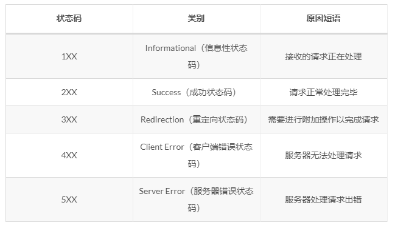
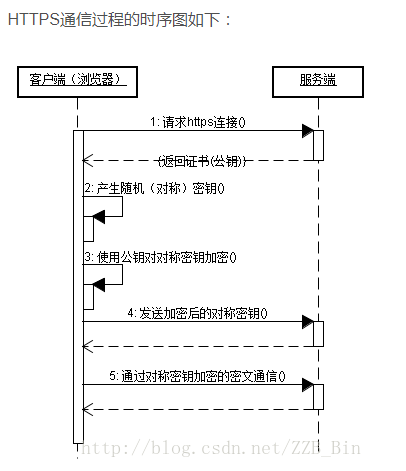

* [HTTP](#http)
  * [http请求报文 &amp; http响应报文](#http%E8%AF%B7%E6%B1%82%E6%8A%A5%E6%96%87--http%E5%93%8D%E5%BA%94%E6%8A%A5%E6%96%87)
  * [http 请求方法](#http-%E8%AF%B7%E6%B1%82%E6%96%B9%E6%B3%95)
  * [Get 和 Post 区别](#get-%E5%92%8C-post-%E5%8C%BA%E5%88%AB)
  * [http状态码](#http%E7%8A%B6%E6%80%81%E7%A0%81)
  * [长连接 短连接 无状态](#%E9%95%BF%E8%BF%9E%E6%8E%A5-%E7%9F%AD%E8%BF%9E%E6%8E%A5-%E6%97%A0%E7%8A%B6%E6%80%81)
  * [转发与重定向的区别](#%E8%BD%AC%E5%8F%91%E4%B8%8E%E9%87%8D%E5%AE%9A%E5%90%91%E7%9A%84%E5%8C%BA%E5%88%AB)
  * [Cookie 与 Session](#cookie-%E4%B8%8E-session)
* [HTTPS](#https)
  * [HTTPS的通信过程](#https%E7%9A%84%E9%80%9A%E4%BF%A1%E8%BF%87%E7%A8%8B)
  * [https与http区别](#https%E4%B8%8Ehttp%E5%8C%BA%E5%88%AB)
  * [SSL工作原理](#ssl%E5%B7%A5%E4%BD%9C%E5%8E%9F%E7%90%86)
* [浏览器中输入URL到页面加载的发生了什么](#%E6%B5%8F%E8%A7%88%E5%99%A8%E4%B8%AD%E8%BE%93%E5%85%A5url%E5%88%B0%E9%A1%B5%E9%9D%A2%E5%8A%A0%E8%BD%BD%E7%9A%84%E5%8F%91%E7%94%9F%E4%BA%86%E4%BB%80%E4%B9%88)
* [WebSocket](#websocket)
* [Restful](#Restful)

HTTP
---------

### http请求报文 & http响应报文

**HTTP请求报文分为三个部分**：请求行（包括请求方法、URI、HTTP版本信息）、请求头、消息主体。

HTTP定义了与服务器交互的不同方法，最基本的方法有4种，分别是GET，POST，PUT，DELETE。一个URL地址，它用于描述一个网络上的资源，而
HTTP 中的GET，POST，PUT，DELETE就对应着对这个资源的查，增，改，删4个操作。

**HTTP响应报文**分为三个部分：状态行（包括HTTP版本、状态码、状态码的原因短语）、响应头、消息主体。

状态码(Status
Code)：描述了响应的状态。可以用来检查是否成功的完成了请求。请求失败的情况下，状态码可用来找出失败的原因。

HTTP头部(HTTP
Header)：它们包含了更多关于响应的信息。比如：头部可以指定认为响应过期的过期日期，或者是指定用来给用户安全的传输实体内容的编码格式。

主体(Body)：它包含了响应的内容。它可以包含HTML代码，图片，等等。主体是由传输在HTTP消息中紧跟在头部后面的数据字节组成的。

### http 请求方法

**GET**：用于请求访问已经被URI（统一资源标识符）识别的资源，可以通过URL传参给服务器。

**POST**：用于传输信息给服务器，主要功能与GET方法类似，但一般推荐使用POST方式。

**PUT** ：传输文件，报文主体中包含文件内容，保存到对应URI位置。

**DELETE**：删除文件，与PUT方法相反，删除对应URI位置的文件。

**HEAD**：获得报文首部，与GET方法类似，只是不返回报文主体，一般用于验证URI是否有效。

**OPTIONS**：查询相应URI支持的HTTP方法。

### Get 和 Post 区别

**作用：**
GET 用于获取资源，而 POST 用于传输实体主体。

**参数：**
GET 和 POST 的请求都能使用额外的参数，但是 GET
的参数是以查询字符串出现在 URL 中，而 POST 的参数存储在实体主体中。但是不能因为
POST
参数存储在实体主体中就认为它的安全性更高，因为照样可以通过一些抓包工具（Fiddler）查看。Get传输的数据量小，因为受URL长度限制，但效率较高；Post可以传输大量数据，所以上传文件时只能用Post方式

**安全：**
安全的 HTTP 方法不会改变服务器状态，也就是说它只是可读的。GET
方法是安全的，而 POST 却不是，因为 POST
的目的是传送实体主体内容，这个内容可能是用户上传的表单数据，上传成功之后，服务器可能把这个数据存储到数据库中，因此状态也就发生了改变。安全的方法除了
GET 之外还有：HEAD、OPTIONS。不安全的方法除了 POST 之

外还有 PUT、DELETE。GET请求可以被浏览器缓存，POST不能

**幂等性：**
幂等的 HTTP方法，同样的请求被执行一次与连续执行多次的效果是一样的，服务器的状态也是一样的。换句话说就是，幂等方法不应该具有副作用。所有的安全方法也都是幂等的。在正确实现的条件下，GET，HEAD，PUT和 DELETE 等方法都是幂等的，而 POST 方法不是。

### http状态码

**常见的HTTP相应状态码**

**100** Continue
表明到目前为止都很正常，客户端可以继续发送请求或者忽略这个响应。

**200** OK 客户端请求成功

**301** Moved Permanently 请求永久重定向

**302** Moved Temporarily 请求临时重定向

**304** Not Modified 文件未修改，可以直接使用缓存的文件。

**400** Bad Request 由于客户端请求有语法错误，不能被服务器所理解。

**401** Unauthorized 请求未经授权。

**403** Forbidden 服务器收到请求，但是拒绝提供服务。

**404** Not Found 请求的资源不存在，例如，输入了错误的URL

**500** Internal Server Error
服务器发生不可预期的错误，导致无法完成客户端的请求。

**503** Service Unavailable
服务器当前不能够处理客户端的请求，在一段时间之后，服务器可能会恢复正常

### 长连接 短连接 无状态

**无状态：**
HTTP协议是无状态的，指的是协议对于事务处理没有记忆能力，服务器不知道客户端是什么状态。也就是说，打开一个服务器上的网页和上一次打开这个服务器上的网页之间没有任何联系。HTTP是一个无状态的面向连接的协议，无状态不代表HTTP不能保持TCP连接，更不能代表HTTP使用的是UDP协议（无连接）。

HTTP 协议是无状态的，主要是为了让 HTTP
协议尽可能简单，使得它能够处理大量事务。**HTTP/1.1 引入 Cookie来保存状态信息**。Cookie
是服务器发送到用户浏览器并保存在本地的一小块数据，它会在浏览器之后向同一服务器再次发起请求时被携带上，用于告知服务端两个请求是否来自同一浏览器。由于之后每次请求都会需要携带
Cookie 数据，因此会带来额外的性能开销。

除了可以将用户信息通过 Cookie 存储在用户浏览器中，也可以利用 Session
存储在服务器端，存储在服务器端的信息更加安全。Session
可以存储在服务器上的文件、数据库或者内存中，也可以将 Session 存储在 Redis
这种内存型数据库中，效率会更高。

**短连接：**
在HTTP/1.0中默认使用短连接。也就是说，客户端和服务器每进行一次HTTP操作，就建立一次连接，任务结束就中断连接。当客户端浏览器访问的某个HTML或其他类型的Web页中包含有其他的Web资源（如JavaScript文件、图像文件、CSS文件等），每遇到这样一个Web资源，浏览器就会重新建立一个HTTP会话。

**长连接：**
而从HTTP/1.1起，默认使用长连接，用以保持连接特性。使用长连接的HTTP协议，会在响应头加入这行代码：Connection:keep-alive。

在使用长连接的情况下，当一个网页打开完成后，客户端和服务器之间用于传输HTTP数据的TCP连接不会关闭，客户端再次访问这个服务器时，会继续使用这一条已经建立的连接。Keep-Alive不会永久保持连接，它有一个保持时间，可以在不同的服务器软件（如Apache）中设定这个时间。实现长连接需要客户端和服务端都支持长连接。

**HTTP协议的长连接和短连接，实质上是TCP协议的长连接和短连接。**

**长连接多用于操作频繁，点对点的通讯，而且连接数不能太多情况**。每个TCP连接都需要三步握手，这需要时间，如果每个操作都是先连接，再操作的话那么处理速度会降低很多，所以每个操作完后都不断开，次处理时直接发送数据包就OK了，不用建立TCP连接。例如：数据库的连接用长连接，如果用短连接频繁的通信会造成socket错误，而且频繁的socket创建也是对资源的浪费。

而像WEB网站的http服务一般都用**短链接**，因为长连接对于服务端来说会耗费一定的资源，而像WEB网站这么频繁的成千上万甚至上亿客户端的连接用短连接会更省一些资源，如果用长连接，而且同时有成千上万的用户，如果每个用户都占用一个连接的话，那可想而知吧。**所以并发量大，但每个用户无需频繁操作情况下需用短连好。**

http1.0与http1.1的区别

**长连接（PersistentConnection）**

HTTP 1.1支持长连接（PersistentConnection），HTTP
1.0规定浏览器与服务器只保持短暂的连接，浏览器的每次请求都需要与服务器建立一个TCP连接，服务器完成请求处理后立即断开TCP连接，服务器不跟踪每个客户也不记录过去的请求。

**流水线（Pipelining）**

请求的流水线（Pipelining）处理，在一个TCP连接上可以传送多个HTTP请求和响应，减少了建立和关闭连接的消耗和延迟。例如：一个包含有许多图像的网页文件的多个请求和应答可以在一个连接中传输，但每个单独的网页文件的请求和应答仍然需要使用各自的连接。

HTTP
1.1还允许客户端不用等待上一次请求结果返回，就可以发出下一次请求，但服务器端必须按照接收到客户端请求的先后顺序依次回送响应结果，以保证客户端能够区分出每次请求的响应内容。

**host字段**

在HTTP1.0中认为每台服务器都绑定一个唯一的IP地址，因此，请求消息中的URL并没有传递主机名（hostname）。但随着虚拟主机技术的发展，在一台物理服务器上可以存在多个虚拟主机（Multi-homed
Web Servers），并且它们共享一个IP地址。

HTTP1.1的请求消息和响应消息都应支持Host头域，且请求消息中如果没有Host头域会报告一个错误（400
Bad Request）。此外，服务器应该接受以绝对路径标记的资源请求。

**100(Continue) Status**

HTTP/1.1加入了一个新的状态码100（Continue）。客户端事先发送一个只带头域的请求，如果服务器因为权限拒绝了请求，就回送响应码401（Unauthorized）；如果服务器接收此请求就回送响应码100，客户端就可以继续发送带实体的完整请求了。100
(Continue) 状态代码的使用，允许客户端在发request消息body之前先用request
header试探一下server，看server要不要接收request body，再决定要不要发request
body。

**cache**

HTTP/1.1在1.0的基础上加入了一些cache的新特性，当缓存对象的Age超过Expire时变为stale对象，cache不需要直接抛弃stale对象，而是与源服务器进行重新激活（revalidation）。

http1.0 与 http2.0的区别

**新的二进制格式（Binary
Format）**：HTTP1.x的解析是基于文本。基于文本协议的格式解析存在天然缺陷，文本的表现形式有多样性，要做到健壮性考虑的场景必然很多，二进制则不同，只认0和1的组合。基于这种考虑HTTP2.0的协议解析决定采用二进制格式，实现方便且健壮。

**多路复用（MultiPlexing）**：即连接共享，建立起一个连接请求后，可以在这个链接上一直发送，不要等待上一次发送完并且受到回复后才能发送下一个（http1.0是这样），是可以同时发送多个请求，互相并不干扰。

**header压缩：**
如上文中所言，对前面提到过HTTP1.x的header带有大量信息，而且每次都要重复发送，HTTP2.0利用HPACK对消息头进行压缩传输，客服端和服务器维护一个

动态链表（当一个头部没有出现的时候，就插入，已经出现了就用表中的索引值进行替代），将既避免了重复header的传输，又减小了需要传输的大小。

**服务端推送（server
push）**：就是客户端请求html的时候，服务器顺带把此html需要的css,js也一起发送给客服端，而不像http1.0中需要请求一次html，然后再请求一次css，然后再请求一次js。

### 转发与重定向的区别

一句话，转发是服务器行为，重定向是客户端行为。

**转发过程：**
客户浏览器发送http请求web服务器接受此请求调用内部的一个方法在容器内部完成请求处理和转发动作将目标资源发送给客户。

在这里，转发的路径必须是同一个web容器下的url，其不能转向到其他的web路径上去，中间传递的是自己的容器内的request。在客户浏览器路径栏显示的仍然是其第一次访问的路径，也就是说客户是感觉不到服务器做了转发的。转发行为是浏览器只做了一次访问请求。

**重定向过程：**
客户浏览器发送http请求web服务器接受后发送302状态码响应及对应新的location给客户浏览器客户浏览器发现是302响应，则**自动**再发送一个新的http请求，请求url是新的location地址服务器根据此请求寻找资源并发送给客户。

在这里location可以重定向到任意URL，既然是浏览器重新发出了请求，则就没有什么request传递的概念了。在客户浏览器路径栏显示的是其重定向的路径，客户可以观察到地址的变化的。重定向行为是浏览器做了至少两次的访问请求的。

###  Cookie 与 Session

Cookies是服务器在本地机器上存储的小段文本并随每一个请求发送至同一个服务器。

具体来说Cookie机制采用的是在客户端保持状态的方案。它是在用户端的会话状态的存贮机制，主要是为了解决了HTTP协议无状态的缺陷。

Cookie的内容主要包括：名字，值，过期时间，路径和域。路径与域一起构成cookie的作用范围。若不设置过期时间，则表示这个cookie的生命期为浏览器会话期间，关闭浏览器窗口，cookie就消失。这种生命期为浏览器会话期的cookie被称为会话cookie。若设置了过期时间，浏览器就会把cookie保存到硬盘上，关闭后再次打开浏览器，这些cookie仍然有效直到超过设定的过期时间。

Session机制是一种服务器端的机制，服务器使用一种类似于散列表的结构（也可能就是使用散列表）来保存信息。当程序需要为某个客户端的请求创建一个session时，服务器首先检查这个客户端的请求里是否已包含了一个session标识（称为session
id），如果已包含则说明以前已经为此客户端创建过session，服务器就按照session
id把这个session检索出来使用（检索不到，会新建一个），如果客户端请求不包含session
id，则为此客户端创建一个session并且生成一个与此session相关联的session id。

**客户端保存这个session
id**的方式可以采用cookie，这样在交互过程中浏览器可以自动的按照规则把这个标识发挥给服务器。Cookie与Session都能够进行会话跟踪，但是完成的原理不太一样。

**隐私策略的不同**

Cookie存储在客户端中，对客户端是可见的，客户端的一些程序可能会窥探、复制以至修正Cookie中的内容。而Session存储在服务器上，对客户端是透明的，不存在敏感信息泄露的风险。

假如选用Cookie，比较好的方法是，敏感的信息如账号密码等尽量不要写到Cookie中。最好将Cookie信息加密，提交到服务器后再进行解密，保证Cookie中的信息只要本人能读得懂(设置HttpOnly
= true，那此Cookie
只能通过服务器端修改，本地Js是操作不了的)。但选择Session就省事多了，反正是放在服务器上，Session里任何隐私都能够有效的保护。

**有效期上的不同**

Cookie的过期时间属性为一个很大很大的数字，但是Session不能完成信息长时间有效的效果。而且假如设置Session的超时时间过长，服务器累计的Session就会越多，越容易招致内存溢出。

**服务器压力的不同**

Session是保管在服务器端的，每个用户都会产生一个Session。假如并发访问的用户十分多，会产生十分多的Session，耗费大量的内存。而Cookie保管在客户端，不占用服务器资源。

**浏览器支持的不同**

Cookie是需要客户端浏览器支持的。假如客户端禁用了Cookie，或者不支持Cookie，则Cookie会失效。

#### cookie和token都存放在header里面，为什么只劫持前者？

cookie是有状态的，意味着验证记录或者会话需要一直在服务端或者客户端保持。而token是无状态的，服务器不记录哪些用户登录了或者哪些
JWT
被发布了，只判断token是否有效，通常我们都会给token设置有效时间，来确保不被劫持。所有劫持cookie比劫持token，更有效，毕竟cookie在某种情况下可以一直使用下去，而token不行。

HTTPS
---------

超文本传输协议HTTP协议被用于在Web浏览器和网站服务器之间传递信息，HTTP协议以明文方式发送内容，不提供任何方式的数据加密，如果攻击者截取了Web浏览器和网站服务器之间的传输报文，就可以直接读懂其中的信息，因此，HTTP协议不适合传输一些敏感信息，比如：信用卡号、密码等支付信息。为了解决HTTP协议的这一缺陷，需要使用另一种协议：安全套接字层超文本传输协议HTTPS，为了数据传输的安全，HTTPS在HTTP的基础上加入了SSL协议，SSL依靠证书来验证服务器的身份，并为浏览器和服务器之间的通信加密。

**HTTPS：是以安全为目标的HTTP通道，简单讲是HTTP的安全版**，即HTTP下加入SSL层，HTTPS的安全基础是SSL，因此加密的详细内容就需要SSL。HTTPS协议的主要作用可以分为两种：一种是建立一个信息安全通道，来保证数据传输的安全；另一种就是确认网站的真实性。

### HTTPS的通信过程

**客户端发起HTTPS请求：**
用户在浏览器里输入一个HTTPS网址，然后连接到服务端的443端口。

服务端的配置：采用HTTPS协议的服务器必须要有一套数字证书，可以自己制作，也可以向组织申请。区别就是自己颁发的证书需要客户端验证通过，才可以继续访问，而使用受信任的公司申请的证书则不会弹出提示页面。这套证书其实就是一对公钥和私钥。如果对公钥不太理解，可以想象成一把钥匙和一个锁头，只是世界上只有你一个人有这把钥匙，你

可以把锁头给别人，别人可以用这个锁把重要的东西锁起来，然后发给你，因为只有你一个人有这把钥匙，所以只有你才能看到被这把锁锁起来的东西。

**传送证书：**
这个证书其实就是公钥，只是包含了很多信息，如证书的颁发机构，过期时间等等。

**客户端解析证书：**
这部分工作是由客户端的SSL/TLS来完成的，首先会验证公钥是否有效，比如颁发机构，过期时间等等，如果发现异常，则会弹出一个警示框，提示证书存在的问题。如果证书没有问题，那么就生成一个随机值。然后用证书（也就是公钥）对这个随机值进行加密。就好像上面说的，把随机值用锁头锁起来，这样除非有钥匙，不然看不到被锁住的内容。

**传送加密信息：**
这部分传送的是用证书加密后的随机值，目的是让服务端得到这个随机值，以后客户端和服务端的通信就可以通过这个随机值来进行加密解密了。

**服务端解密信息**：
服务端用私钥解密后，得到了客户端传过来的随机值，然后把内容通过该随机值进行对称加密，将信息和私钥通过某种算法混合在一起，这样除非知道私钥，不然无法获取内容，而正好客户端和服务端都知道这个私钥，所以只要加密算法够彪悍，私钥够复杂，数据就够安全。

**传输加密后的信息：**
这部分信息就是服务端用私钥加密后的信息，可以在客户端用随机值解密还原。

### https与http区别

https协议需要到ca申请证书，一般免费证书较少，因而需要一定费用。

http是超文本传输协议，信息是明文传输，https则是具有安全性的ssl加密传输协议。

http和https使用的是完全不同的连接方式，用的端口也不一样，前者是80，后者是443。

http的连接很简单，是无状态的，HTTPS协议是由SSL+HTTP协议构建的可进行加密传

输、身份认证的网络协议，比http协议安全。

### SSL工作原理

>   <https://blog.csdn.net/ENERGIE1314/article/details/54581411/>

>   **三种协议：1.握手协议 2.记录协议 3，警报协议**

浏览器中输入URL到页面加载的发生了什么
-----------------------------------------

**一般会经历以下几个过程：**

1、在浏览器地址栏中输入url

2、浏览器先查看**浏览器缓存-系统缓存-路由器缓存**，如果缓存中有，会直接在屏幕中显示页面内容。若没有，则跳到第三步操作。

3、在发送http请求前，需要**域名解析(DNS解析)**，解析获取相应的IP地址。

4、浏览器向服务器发起tcp连接，与浏览器建立tcp三次握手。

5、握手成功后，浏览器向服务器发送http请求，请求数据包。

6、服务器处理收到的请求，将数据返回至浏览器

7、浏览器收到HTTP响应

8、读取页面内容，浏览器渲染，解析html源码

9、生成Dom树、解析css样式、js交互

10、客户端和服务器交互

**步骤2的具体过程是：**

**浏览器缓存**：浏览器会记录DNS一段时间，因此，只是第一个地方解析DNS请求；

**操作系统缓存**：如果在浏览器缓存中不包含这个记录，则会使系统调用操作系统，获取操作系统的记录(保存最近的DNS查询缓存)；

**路由器缓存**：如果上述两个步骤均不能成功获取DNS记录，继续搜索路由器缓存；

**ISP缓存**：若上述均失败，继续向ISP搜索。

**DNS的工作原理及过程分下面几个步骤：**

1、客户机提出域名解析请求，并将该请求发送给本地的域名服务器。

2、当本地的域名服务器收到请求后，就先查询本地的缓存，如果有该纪录项，则本地的域名服务器就直接把查询的结果返回。

3、如果本地的缓存中没有该纪录，则本地域名服务器就直接把请求发给根域名服务器，然后根域名服务器再返回给本地域名服务器一个所查询域(根的子域)
的主域名服务器的地址。

4、本地服务器再向上一步返回的域名服务器发送请求，然后接受请求的服务器查询自己的缓存，如果没有该纪录，则返回相关的下级的域名服务器的地址。

5、重复第四步，直到找到正确的纪录。

6、本地域名服务器把返回的结果保存到缓存，以备下一次使用，同时还将结果返回给客户机。

WebSocket
-------------

WebSocket解决的问题是实现客户端与服务端的双向通信，它的特点如下：

（1）建立在TCP协议之上，服务器端的实现比较容易。

（2）与HTTP协议有着良好的兼容性。默认端口也是80和443，并且**握手阶段采用
HTTP协议**，因此握手时不容易屏蔽，能通过各种HTTP代理服务器。

（3）数据格式比较轻量，性能开销小，通信高效。

（4）可以发送文本，也可以发送二进制数据。

（5）没有同源限制，客户端可以与任意服务器通信。

**实际上，它的最大的特点在于服务端可以主动的向客户端推送消息。**

**WebSocket是HTML5出的东西（协议）**，也就是说HTTP协议没有变化，或者说没关系，但HTTP是不支持持久连接的（长连接，循环连接的不算）。首先HTTP有1.1和1.0之说，也就是所谓的keep-alive，把多个HTTP请求合并为一个，但是Websocket其实是一个新协议，跟HTTP协议基本没有关系，只是为了兼容现有浏览器的握手规范而已，也就是说它是HTTP协议上的一种补充。

HTTP的生命周期通过Request来界定，也就是一个Request
一个Response，那么在HTTP1.0中，这次HTTP请求就结束了。在HTTP1.1中进行了改进，使得有一个keep-alive，也就是说，在一个HTTP连接中，可以发送多个Request，接收多个Response。但是请记住
Request =
Response，在HTTP中永远是这样，也就是说一个request只能有一个response。而且这个response也是被动的，不能主动发起。

Restful 
-------------

REST的全称是Representational State
Transfer，中文含义为**表现层状态变化**。符合REST规范的设计，都可以称为RESTful设计。

RESTful的设计哲学主要将服务器提供的内容实体看作一个资源，并表现在URL上。对这个资源的操作，主要体现在HTTP请求的方法上，不是体现在URL上。

**所谓"资源"**，就是网络上的一个实体，或者说是网络上的一个具体信息。它可以是一段文本、一张图片、一首歌曲、一种服务，总之就是一个具体的实在。你可以用一个URI（统一资源定位符）指向它，每种资源对应一个特定的URI。要获取这个资源，访问它的URI就可以，因此URI就成了每一个资源的地址或独一无二的识别符。**"资源"是一种信息实体**，它可以有多种外在表现形式,把"资源"具体呈现出来的形式，叫做它的"表现层"（Representation）。比如图片可以用JPG格式表现，也可以用PNG格式表现。**URI只代表资源的实体，不代表它的形式.**

访问一个网站，就代表了客户端和服务器的一个互动过程。在这个过程中，势必涉及到数据和状态的变化。

互联网通信协议HTTP协议，是一个无状态协议。这意味着，所有的状态都保存在服务器端。因此，如果客户端想要操作服务器，必须通过某种手段，让服务器端发生"状态转化"（State
Transfer）。而这种转化是建立在表现层之上的，所以就是"表现层状态转化"。

**客户端用到的手段，只能是HTTP协议。**具体来说，就是HTTP协议里面，四个表示操作方式的动词：GET、POST、PUT、DELETE。它们分别对应四种基本操作：GET用来获取资源，POST用来新建资源（也可以用于更新资源），PUT用来更新资源，DELETE用来删除资源。

综上来看：

（1）每一个URI代表一种资源

（2）客户端和服务器之间，传递这种资源的某种表现层

（3）客户端通过四个HTTP动词，对服务器端资源进行操作，实现表现层状态转化

