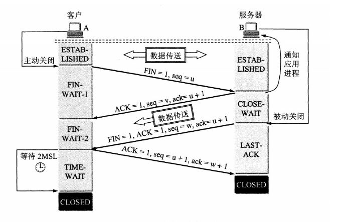
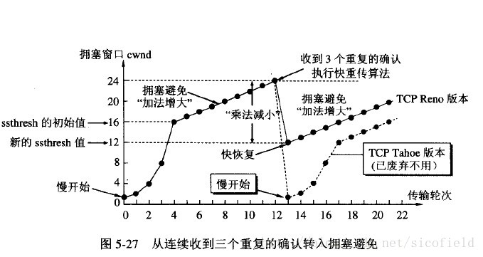
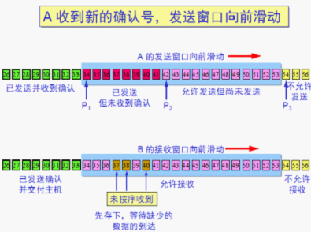
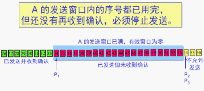

* [UDP](#udp)
  * [UDP的报文结构](#udp%E7%9A%84%E6%8A%A5%E6%96%87%E7%BB%93%E6%9E%84)
  * [UDP特性](#udp%E7%89%B9%E6%80%A7)
  * [UDP的缺陷](#udp%E7%9A%84%E7%BC%BA%E9%99%B7)
  * [对UDP一次发送多少bytes好](#%E5%AF%B9udp%E4%B8%80%E6%AC%A1%E5%8F%91%E9%80%81%E5%A4%9A%E5%B0%91bytes%E5%A5%BD)
* [TCP](#tcp)
  * [TCP的报文格式](#tcp%E7%9A%84%E6%8A%A5%E6%96%87%E6%A0%BC%E5%BC%8F)
  * [TCP三次握手](#tcp%E4%B8%89%E6%AC%A1%E6%8F%A1%E6%89%8B)
  * [TCP四次挥手](#tcp%E5%9B%9B%E6%AC%A1%E6%8C%A5%E6%89%8B)
  * [TCP粘包/拆包问题](#tcp%E7%B2%98%E5%8C%85%E6%8B%86%E5%8C%85%E9%97%AE%E9%A2%98)
  * [TCP如何保证可靠性传输](#tcp%E5%A6%82%E4%BD%95%E4%BF%9D%E8%AF%81%E5%8F%AF%E9%9D%A0%E6%80%A7%E4%BC%A0%E8%BE%93)
  * [滑动窗口机制](#%E6%BB%91%E5%8A%A8%E7%AA%97%E5%8F%A3%E6%9C%BA%E5%88%B6)
  * [TCP状态转移](#tcp%E7%8A%B6%E6%80%81%E8%BD%AC%E7%A7%BB)
  * [TCP第三次握手失败后怎么办](#tcp%E7%AC%AC%E4%B8%89%E6%AC%A1%E6%8F%A1%E6%89%8B%E5%A4%B1%E8%B4%A5%E5%90%8E%E6%80%8E%E4%B9%88%E5%8A%9E)
  * [TCP当被告知接收窗口为0后的行为](#tcp%E5%BD%93%E8%A2%AB%E5%91%8A%E7%9F%A5%E6%8E%A5%E6%94%B6%E7%AA%97%E5%8F%A3%E4%B8%BA0%E5%90%8E%E7%9A%84%E8%A1%8C%E4%B8%BA)
  * [一个 TCP 连接上面能发多少 HTTP请求](#%E4%B8%80%E4%B8%AA-tcp-%E8%BF%9E%E6%8E%A5%E4%B8%8A%E9%9D%A2%E8%83%BD%E5%8F%91%E5%A4%9A%E5%B0%91-http%E8%AF%B7%E6%B1%82)
* [TCP与UDP区别](#tcp%E4%B8%8Eudp%E5%8C%BA%E5%88%AB)

## UDP

UDP是一种**属于传输层**的用户数据报**（User Datagram
Protocol）**协议，无连接，不保证传输的可靠性。对于来自应用层的数据包，直接加上**UDP报头**然后传送给IP。UDP头部中有一个校验和字段，可用于差错的检测，但是UDP是不提供差错纠正的。此外IPV4不强制这个校验和字段必须使用，但IPV6是强制要求使用的。

UDP报文没有可靠性保证、顺序保证和流量控制字段等，可靠性较差。但是正因为UDP协议的控制选项较少，在数据传输过程中延迟小、数据传输效率高，适合对可靠性要求不高的应用程序，或者可以保障可靠性的应用程序，如DNS、TFTP、SNMP等。

### UDP的报文结构

UDP在IP报文中的位置如下图所示：

**UDP的报头结构如下**，其中：

1.源端口号如果不需要可以置0。

2.长度字段是UDP首部和UDP数据的总长度，这个字段是冗余的，因为IP中包含了数据报长度信息。

3.校验和字段是端到端的，它覆盖了UDP头部、UDP数据、一个伪头部、填充字节，由初始的发送方计算得到，由最终的目的方计算然后校验。

###  UDP特性

UDP是一个无连接协议，传输数据之前源端和终端不建立连接，当UDP它想传送时就简单地去抓取来自应用程序的数据，并尽可能快地把它扔到网络上。在发送端，UDP传送数据的速度仅仅是受应用程序生成数据的速度、计算机的能力和传输带宽的限制;在接收端，UDP把每个消息段放在队列中，应用程序每次从队列中读一个消息段。

由于传输数据不建立连接，因此也就不需要维护连接状态，包括收发状态等，因此一台服务机可同时向多个客户机传输相同的消息。

UDP信息包的标题很短，只有8个字节，相对于TCP的20个字节信息包的额外开销很小。

吞吐量不受拥挤控制算法的调节，只受应用软件生成数据的速率、传输带宽、源端和终端主机性能的限制。

UDP使用尽最大努力交付，即不保证可靠交付，因此主机不需要维持复杂的链接状态表(这里面有许多参数)。

UDP是面向报文的。发送方的UDP对应用程序交下来的报文，在添加首部后就向下交付给IP层。既不拆分，也不合并，而是保留这些报文的边界，因此，应用程序需要选择合适的报文大小。

###  UDP的缺陷

**UDP传输过程中存在的主要问题：**

>   **1.丢失和乱序：**
因为UDP不提供ACK、序列号等机制，所以是没有办法知道是否有报文丢失以及接收方到达等报文顺序是否和发送方发送的报文数据一样。

>   **2.差错：**
对于差错问题则是可以通过校验和等检测到，但是不提供差错纠正。

>   **3.数据完整性：**
UDP协议头部虽然有16位的校验和，但是IPv4并不强制执行，也就是说UDP无法保证数据的完整性。

**UDP如何解决其传输过程中的问题：**

想要保证数据的可靠投递和正确排序，必须由**应用程序自己实现这些保护功能**，简单思路，既然原生UDP有那么多痛点，所以可以像应用层协议一样在UDP数据包头再加一段包头，从而定义为RUDP[（Reliable
UDP）](http://www.sohu.com/a/208825991_467759)。

>   **1.数据完整性：**
加上一个16或者32位的CRC验证字段。

>   **2.乱序：**
加上一个数据包序列号SEQ。

>   **3.丢包**：需要确认和重传机制，就是和Tcp类似的Ack机制（若中间包丢失可以通过序列号累计而检测到，但是一开始的包就丢失是没有办法通过序列号检测到的）

>   **4.协议字段**：protol字段，标识当前使用协议。

### 对UDP一次发送多少bytes好

首先，TCP/IP通常被认为是一个四层协议系统，包括链路层、网络层、传输层、应用层。**UDP属于传输层,**
下面由下至上一步一步来看:

以太网(Ethernet)数据帧的长度必须在46-1500字节之间,这是由以太网的物理特性决定

的。这个1500字节被称为链路层的**MTU(最大传输单元)**。
但这并不是指链路层的长度被限制在1500字节，其实这个MTU指的是链路层的数据区并不包括链路层的首部和尾部的18个字节。所以**事实上这个1500字节就是网络层IP数据报的长度限制。**因为IP数据报的首部为20字节，所以IP数据报的数据区长度最大为1480字节。而这个1480字节就是用来放TCP传来的TCP报文段或UDP传来的UDP数据报的。又因为UDP数据报的首部8字节，所以UDP数据报的数据区最大长度为1472字节。**这个1472字节就是可以使用的字节数。**

当发送的UDP数据大于1472，也就是说IP数据报大于1500字节，大于MTU。这个时候发送方IP层就需要分片(fragmentation)。把数据报分成若干片，使每一片都小于MTU。而接收方IP层则需要进行数据报的重组。这样就会多做许多事情，而更严重的是，由于UDP的特性，当某一片数据传送中丢失时，无法重组数据报，将导致丢弃整个UDP数据报。因此，在普通的局域网环境下，建议将UDP的数据控制在1472字节以下为好。

**UDP最大数据报长度：**
有两个原因使得大小满额的数据报不能被端到端投递：一是系统的本地协议实现可能有一些限制；二是接收应用程序可能没准备好去接收这么大的数据。

**UDP数据报截断：**
当UDP数据报长度超过接收端允许长度时，会发生数据报截断，之后会有几种处理：丢弃超过应用程序可接收字节的部分；将这些超出的数据存到后续的读操作；通知调用者被截断了多少数据；或者只通知被截断，但不通知具体截断数量。

## TCP

**TCP（Transmission Control Protocol，传输控制协议）**
是面向连接的协议，每一条TCP连接只能有两个端点(endpoint),每一条TCP连接只能是点对点的（一对一），TCP提供可靠交付的服务，TCP提供全双工通信，面向字节流。TCP传送的数据单位协议是
TCP 报文段(segment)。

### TCP的报文格式

**各个段位说明:**

**源端口和目的端口**:各2
字节.端口是传输层与应用层的服务接口.传输层的复用和分用功能都要通过端口才能实现。

**序号:**
占4字节.TCP连接中传送的数据流中的每一个字节都编上一个序号.序号字段的值则指的是本报文段所发送的数据的第一个字节的序号。

**确认号**:占4字节,是期望收到对方的下一个报文段的数据的第一个字节的序号。

**数据偏移/首部长度**:占 4 位,它指出 TCP 报文段的数据起始处距离 TCP
报文段的起始处有多远。

**保留**:占 6 位,保留为今后使用,但目前应置为 0。

**紧急URG**
:当URG=1时,表明紧急指针字段有效.它告诉系统此报文段中有紧急数据,应尽快传送(相当于高优先级的数据)。

**确认ACK:**
只有当 ACK=1 时确认号字段才有效.当 ACK=0 时,确认号无效。

**PSH(PuSH):*
*接收 TCP 收到 PSH = 1
的报文段,就尽快地交付接收应用进程,而不再等到整个缓存都填满了后再向上交付。

**RST (ReSeT):**
当 RST=1 时,表明 TCP连接中出现严重差错（如由于主机崩溃或其他原因）,必须释放连接,然后再重新建立运输连接。

**同步SYN:**
同步 SYN = 1 表示这是一个连接请求或连接接受报文。

**终止FIN:**
用来释放一个连接.FIN=1表明此报文段的发送端的数据已发送完毕,并要求释放运输连接。

**检验和:**
占 2字节.检验和字段检验的范围包括首部和数据这两部分.在计算检验和时,要在 TCP
报文段的前面加上 12 字节的伪首部紧急指针占 16 位,指出在本报文段中紧急数据共有多少个字节。

**选项:**
长度可变.TCP 最初只规定了一种选项,即最大报文段长度 MSS.MSS 告诉对方TCP：“我的缓存所能接收的报文段的数据字段的最大长度是 MSS 个字节.” [MSS(Maximum
Segment Size)是TCP报文段中的数据字段的最大长度.数据字段加上 TCP 首部才等于整个的TCP 报文段]

**填充:**
这是为了使整个首部长度是 4 字节的整数倍

**其他选项:**

>   **窗口扩大:**
占3字节,其中有一个字节表示移位值 S.新的窗口值等于TCP首部中的窗口位数增大到(16 + S),相当于把窗口值向左移动 S 位后获得实际的窗口大小

>   **时间戳:**
占10字节,其中最主要的字段时间戳值字段(4字节)和时间戳回送回答字段(4字节)

>   **选择确认:**
接收方收到了和前面的字节流不连续的两2字节.如果这些字节的序号都在接收窗口之内,那么接收方就先收下这些数据,但要把这些信息准确地告诉发送方,使发送方不要再重复发送这些已收到的数据

### TCP三次握手

三次握手发生在TCP连接的建立阶段：

A的TCP向B发出连接请求报文段,其首部中的同步位SYN = 1,并选择序号 seq = x,表明传送数据时的第一个数据字节的序号是 x

B的TCP收到连接请求报文段后,如同意,则发回确认(B在确认报文段中应使 SYN = 1,使ACK=1,其确认号ack =x﹢1,自己选择的序号 seq = y)

A收到此报文段后向 B 给出确认,其 ACK = 1,确认号 ack = y﹢1(A 的 TCP 通知上层应用进程,连接已经建立,B 的 TCP 收到主机 A 的确认后,也通知其上层应用进程：TCP 连接已经建立)。

**为什么是三次握手而不是采用两次握手？**

**第三次握手是为了防止失效的连接请求到达服务器，让服务器错误打开连接。**

**客户端发送的连接请求如果在网络中滞留，那么就会隔很长一段时间才能收到服务器端发回的连接确认。客户端等待一个超时重传时间之后，就会重新请求连接。但是这个滞留的连接请求最后还是会到达服务器，如果不进行三次握手，那么服务器就会打开两个连接。如果有第三次握手，客户端会忽略服务器之后发送的对滞留连接请求的连接确认，不进行第三次握手，因此就不会再次打开连接。**

### TCP四次挥手

四次握手发生在TCP连接的断开阶段：

**数据传输结束后,**
通信的双方都可释放连接.现在 A 的应用进程先向其 TCP发出连接释放报文段,并停止再发送数据,主动关闭 TCP 连接(A 把连接释放报文段首部的FIN = 1,其序号seq = u,等待 B 的确认)

B 发出确认,确认号 ack = u＋1,而这个报文段自己的序号 seq = v(TCP服务器进程通知高层应用进程.从 A 到 B 这个方向的连接就释放了,**TCP连接处于半关闭状态**.B 若发送数据,A 仍要接收)

若 B 已经没有要向 A 发送的数据,其应用进程就通知 TCP 释放连接A 收到连接释放报文段后,必须发出确认,在确认报文段中 ACK = 1,确认号ack=w﹢1,自己的序号 seq = u + 1

TIME_WAIT的原因：

客户端接收到服务器端的 FIN 报文后进入此状态，此时并不是直接进入 CLOSED状态，还需要等待一个时间计时器设置的时间 2MSL。这么做有两个理由：

**确保最后一个确认报文能够到达。**
如果 B 没收到 A发送来的确认报文，那么就会重新发送连接释放请求报文，A等待一段时间就是为了处理这种情况的发生。

**等待一段时间是为了让本连接持续时间内所产生的所有报文都从网络中消失**，使得下一个新的连接不会出现旧的连接请求报文。

**利用保活计数器可以判断客户端是否断开。**

###  TCP粘包/拆包问题

粘包、拆包表现形式

现在假设客户端向服务端连续发送了两个数据包，用packet1和packet2来表示，那么服务端收到的数据可以分为三种，现列举如下：

第一种情况，接收端正常收到两个数据包，即没有发生拆包和粘包的现象。

第二种情况，接收端只收到一个数据包，由于TCP是不会出现丢包的，所以这一个数据包中包含了发送端发送的两个数据包的信息，这种现象即为粘包。这种情况由于接收端不知道这两个数据包的界限，所以对于接收端来说很难处理。

第三种情况，这种情况有两种表现形式，如下图。接收端收到了两个数据包，但是这两个数据包要么是不完整的，要么就是多出来一块，这种情况即发生了拆包和粘包。这两种情况如果不加特殊处理，对于接收端同样是不好处理的。

**粘包、拆包发生原因**

发生TCP粘包或拆包有很多原因，现列出常见的几点，

1、要发送的数据大于TCP发送缓冲区剩余空间大小，将会发生拆包。

2、待发送数据大于MSS（最大报文长度），TCP在传输前将进行拆包。

3、要发送的数据小于TCP发送缓冲区的大小，TCP将多次写入缓冲区的数据一次发送出去，将会发生粘包。

4、接收数据端的应用层没有及时读取接收缓冲区中的数据，将发生粘包。

**粘包、拆包解决办法**

常用的方法有如下几个：

1、发送端给每个数据包添加包首部，首部中应该至少包含数据包的长度，这样接收端在接收到数据后，通过读取包首部的长度字段，便知道每一个数据包的实际长度了。

2、发送端将每个数据包封装为固定长度（不够的可以通过补0填充），这样接收端每次从接收缓冲区中读取固定长度的数据就自然而然的把每个数据包拆分开来。

3、可以在数据包之间设置边界，如添加特殊符号，这样，接收端通过这个边界就可以将不同的数据包拆分开。

**UDP为什么不会**

UDP是基于报文发送的，从UDP的帧结构可以看出，在UDP首部采用了16bit来指示UDP数据报文的长度，因此在应用层能很好的将不同的数据报文区分开，从而避免粘包和拆包的问题。而TCP是基于字节流的，虽然应用层和TCP传输层之间的数据交互是大小不等的数据块，但是TCP把这些数据块仅仅看成一连串无结构的字节流，没有边界；另外从TCP的帧结构也可以看出，在TCP的首部没有表示数据长度的字段。基于上面两点，在使用TCP传输数据时，才有粘包或者拆包现象发生的可能。

### TCP如何保证可靠性传输

**1.数据包校验：**
目的是检测数据在传输过程中的任何变化，若校验出包有错，则丢弃报文段并且不给出响应，这时TCP发送数据端超时后会重发数据

**2.对失序数据包重排序：**
既然TCP报文段作为IP数据报来传输，而IP数据报的到达可能会失序，因此TCP报文段的到达也可能会失序。TCP将对失序数据进行重新排序，然后才交给应用层

**3.丢弃重复数据：**
对于重复数据，能够丢弃重复数据

**4.应答机制：**
当TCP收到发自TCP连接另一端的数据，它将发送一个确认。这个确认不是立即发送，通常将推迟几分之一秒

**5.超时重发**：当TCP发出一个段后，它启动一个定时器，等待目的端确认收到这个报文段。如果不能及时收到一个确认，将重发这个报文段

**6.流量控制**：流量控制一般指的就是在接收方接受报文段的时候，应用层的上层程序可能在忙于做一些其他的事情，没有时间处理缓存中的数据，如果发送方在发送的时候不控制它的速度很有可能导致接受缓存溢出，导致数据丢失。流量控制的基础是滑动窗口机制。

相对的还有一种情况是由于两台主机之间的网络比较拥塞，如果发送方还是以一个比较快的速度发送的话就可能导致大量的丢包，这个时候也需要发送方降低发送的速度。

虽然看起来上面的两种情况都是由于可能导致数据丢失而让发送主机降低发送速度，但是一定要把这两种情况分开，**因为前者是属于流量控制而后者拥塞控制**。

**7.拥塞控制：**
拥塞控制一般都是由于网络中的主机发送的数据太多导致的拥塞，一般拥塞的都是一些负载比较高的路由，这时候为了获得更好的数据传输稳定性，必须采用拥塞控制，当然也为了减轻路由的负载防止崩溃。

有两个拥塞控制的方法，一个是慢开始与拥塞避免，另外一个称为快重传与快恢复。

**慢开始与拥塞避免：不要一开始就发送大量的数据，先探测一下网络的拥塞程度，也就是说由小到大逐渐增加拥塞窗口的大小，**当然收到单个确认但此确认多个数据报**（实际上应当是字节）**的时候就加相应的数值。所以一次传输轮次之后拥塞窗口就加倍。**这就是乘法增长，和后面的拥塞避免算法的加法增长比较。**

为了防止cwnd增长过大引起网络拥塞，还需设置一个慢开始门限ssthresh状态变量。ssthresh的用法如下：

当cwnd\<ssthresh时，使用慢开始算法。

当cwnd\>ssthresh时，改用拥塞避免算法。

当cwnd=ssthresh时，慢开始与拥塞避免算法任意。

拥塞避免算法让拥塞窗口缓慢增长，即每经过一个往返时间RTT就把发送方的拥塞窗口cwnd加1，而不是加倍。这样拥塞窗口按线性规律缓慢增长。

无论是在慢开始阶段还是在拥塞避免阶段，只要发送方判断网络出现拥塞（**其根据就是没有收到确认，虽然没有收到确认可能是其他原因的分组丢失，但是因为无法判定，所以都当做拥塞来处理）**，就把慢开始门限设置为出现拥塞时的发送窗口大小的一半。然后把拥塞窗口设置为1，执行慢开始算法。如下图：

2.快重传与快恢复

快重传要求接收方在收到一个失序的报文段后就立即发出重复确认（为的是使发送方及早知道有报文段没有到达对方）而不要等到自己发送数据时捎带确认。快重传算法规定，发送方只要一连收到三个重复确认就应当立即重传对方尚未收到的报文段，而不必继续等待设置的重传计时器时间到期。

快重传配合使用的还有快恢复算法，有以下两个要点:

当发送方连续收到三个重复确认时，就执行“乘法减小”算法，把ssthresh门限减半。但是接下去并不执行慢开始算法。

考虑到如果网络出现拥塞的话就不会收到好几个重复的确认，所以发送方现在认为网络可能没有出现拥塞。所以此时不执行慢开始算法，而是将cwnd设置为ssthresh的大小，然后执行拥塞避免算法。如下图

### 滑动窗口机制

TCP的滑动窗口主要有两个作用，一是提供TCP的可靠性，二是提供TCP的流控特性。同时滑动窗口机制还体现了TCP面向字节流的设计思路。可靠：对发送的数据进行确认。流控制：窗口大小随链路变化。

TCP的窗口滑动技术通过动态改变窗口的大小来调节两台主机之间数据传输。每个TCP/IP主机支持全双工数据传输，因此TCP有两个滑动窗口，一个用于接收数据，一个用于发送数据。接收方设备要求窗口大小为0时，表明接收方已经接收了全部数据，或者接收方应用程序没有时间读取数据，要求暂停发送。

TCP在传送数据时，第一次发数据发送方的窗口大小是由链路带宽决定的，但是接受方在接收到发送方的数据后，返回ack确认报文，同时也告诉了发送方自己的窗口大小，此时发送发第二次发送数据时，会改变自己的窗口大小和接受方一致。

当窗口过大时，会导致不必要的数据来拥塞我们的链路，但是窗口太小时，会造成很大的延时。**当链路变好了或者变差了这个窗口还会发生变话，并不是第一次协商好了以后就永远不变了。**

滑动窗口协议是TCP使用的一种流量控制方法。该协议允许发送方在停止并等待接收确认报文前可以连续发送多个分组。由于发送方不必每发一个分组就停下来等待确认，因此该协议可以加速数据的传输。
只有在接收窗口向前滑动时（与此同时也发送了确认），发送窗口才有可能向前滑动，收发两端的窗口按照以上规律不断地向前滑动。

### TCP状态转移

**1.CLOSED：起始点**，在超时或者连接关闭时候进入此状态。

2.LISTEN：服务端在等待连接过来时候的状态，此称为应用程序被动打开（等待客户端来连接）。

**3.SYN_SENT:**
客户端发起连接，发送SYN给服务器端。如果服务器端不能连接，则直接进入CLOSED状态。

**4.SYN_RCVD：**
跟3对应，服务器端接受客户端的SYN请求，服务器端由LISTEN状态进入SYN_RCVD状态。同时服务器端要回应一个ACK，同时发送一个SYN给客户端；另外一种情况，客户端在发起SYN的同时接收到服务器端得SYN请求，客户端就会由SYN_SENT到
SYN_RCVD状态。

**5.ESTABLISHED：**
服务器端和客户端在完成3次握手进入状态，说明已经可以开始传输数据了

**以上是建立连接时服务器端和客户端产生的状态转移说明。下面是连接关闭时候的状态转移说明，关闭需要进行4次双方的交互，还包括要处理一些善后工作（TIME_WAIT状态），注意，这里主动关闭的一方或被动关闭的一方不是指特指服务器端或者客户端，是相对于谁先发起关闭请求来说的：**

**6.FIN_WAIT_1:**
主动关闭的一方，由状态5进入此状态。具体的动作时发送FIN给对方。

**7.FIN_WAIT_2:**
主动关闭的一方，接收到对方的FINACK，进入此状态。由此不能再接收对方的数据。但是能够向对方发送数据。

**8.CLOSE_WAIT：**
接收到FIN以后，被动关闭的一方进入此状态。具体动作时接收到FIN，同时发送ACK。

**9.LAST_ACK：**
被动关闭的一方，发起关闭请求，由状态8进入此状态。具体动作时发送FIN给对方，同时在接收到ACK时进入CLOSED状态。

**10.CLOSING：**
两边同时发起关闭请求时，会由FIN_WAIT_1进入此状态。具体动作是，接收到FIN请求，同时响应一个ACK。

**11.TIME_WAIT：**
最纠结的状态来了。从状态图上可以看出，有3个状态可以转化成它，

* a.由FIN_WAIT_2进入此状态：在双方不同时发起FIN的情况下，主动关闭的一方在完成自身发起的关闭请求后，接收到被动关闭一方的FIN后进入的状态。
* b.由CLOSING状态进入:双方同时发起关闭，都做了发起FIN的请求，同时接收到了FIN并做了ACK的情况下，由CLOSING状态进入。
* c.由FIN_WAIT_1状态进入：同时接受到FIN（对方发起），ACK（本身发起的FIN回应），与b的区别在于本身发起的FIN回应的ACK先于对方的FIN请求到达，而b是FIN先到达。这种情况概率最小。

###  TCP第三次握手失败后怎么办

当客户端收到服务端的SYN+ACK应答后，其状态变为ESTABLISHED，并会发送ACK包给服务端，准备发送数据了。如果此时ACK在网络中丢失，过了超时计时器后，那么Server端会重新发送SYN+ACK包，重传次数根据/proc/sys/net/ipv4/tcp_synack_retries来指定，默认是5次。

如果重传指定次数到了后，仍然未收到ACK应答，那么一段时间后，Server自动关闭这个连接。**但是Client认为这个连接已经建立**，如果Client端向Server写数据，Server端将以RST包响应，方能感知到Server的错误。

### TCP当被告知接收窗口为0后的行为

当被告知接收窗口为0后，发送方不能再发送了，它会定期的发出一个探测信号以搞清这个窗口什么时间再次打开。如果发送方从来没有收到ACK（正常的窗口探测你肯定是能得到应答）信息，它就一直不断地重试，直到定时器过期。

### 一个 TCP 连接上面能发多少 HTTP请求

HTTP/1.0中，一个服务器在发送完一个HTTP响应后，会断开TCP链接。但是这样每次请求都会重新建立和断开
TCP 连接，代价过大。

HTTP/1.1就把 Connection 头写进标准，默认开启持久连接，除非请求中写明 Connection:
close，那么浏览器和服务器之间是会维持一段时间TCP连接，不会一个请求结束就断掉。这样的好处是连接可以被重新使用，之后发送 HTTP 请求的时候不需要重新建立 TCP 连接，以及如果维持连接，那么 SSL 的开销也可以避免。

HTTP/1.1
存在一个问题，单个 TCP
连接在同一时刻只能处理一个请求，意思是说：两个请求的生命周期不能重叠，任意两个
HTTP 请求从开始到结束的时间在同一个 TCP 连接里不能重叠。

HTTP/1.1 规范中规定了 Pipelining
来试图解决这个问题，但是这个功能在浏览器中默认是关闭的。

> Pipelining:一个支持持久连接的客户端可以在一个连接中发送多个请求（不需要等待任意请求的响应）,收到请求的服务器必须按照请求收到的顺序发送响应。

Pipelining 这种设想看起来比较美好，但是在实践中会出现许多问题。这是因为HTTP/1.1是个文本协议，同时返回的内容也并不能区分对应于哪个发送的请求，所以请求和响应顺序必须维持一致。这样的话在建立起一个TCP连接之后，假设客户端在这个连接连续向服务器发送了几个请求。按照标准，服务器应该按照收到请求的顺序返回结果，假设服务器在处理首个请求时花费了大量时间，那么后面所有的请求都需要等着首个请求结束才能响应。

**HTTP/1.1 时代，浏览器主要通过以下面两点提高页面加载效率：**

1.维持和服务器已经建立的 TCP 连接，在同一连接上顺序处理多个请求。

2.和服务器建立多个 TCP 连接（浏览器对同一 Host 建立 TCP 连接有限制）。

在 HTTP/1.1 时代，那个时候没有多路传输，当浏览器拿到一个有几十张图片的网页该怎么办呢？肯定不能只开一个 TCP 连接顺序下载，那样用户肯定等的很难受。
但是如果每个图片都开一个 TCP 连接发 HTTP 请求，那电脑或者服务器都可能受不了，要是有 1000 张图片的话总不能开 1000 个TCP 连接吧，你的电脑同意 NAT 也不一定会同意。所以答案是：有，Chrome 最多允许对同一个 Host 建立六个 TCP 连接。不同的浏览器有一些区别。

**这样的话如果一个 HTML 页面包含几十个图片标签，这些图片是以什么方式、什么顺序、建立了多少连接、使用什么协议被下载下来的呢**？

* 如果图片都是 HTTPS 连接并且在同一个域名下，那么浏览器在 SSL 握手之后会和服务器商量能不能用 HTTP2，如果能的话就使用 Multiplexing 功能在这个连接上进行多路传输。不过也未必会所有挂在这个域名的资源都会使用一个 TCP 连接去获取，但是可以确定的是 Multiplexing 很可能会被用到。
* 如果发现用不了 HTTP2 呢？或者用不了 HTTPS（现实中的 HTTP2 都是在 HTTPS 上实现的，所以也就是只能使用 HTTP/1.1）。那浏览器就会在一个 HOST 上建立多个 TCP 连接，连接数量的最大限制取决于浏览器设置，这些连接会在空闲的时候被浏览器用来发送新的请求。如果所有的连接都正在发送请求呢？那其他的请求就只能等等了。

TCP与UDP区别
------------------

UDP首部8个字节，TCP首部最低20个字节。

**TCP对应的协议：**

1、**FTP**：定义了文件传输协议，使用21端口。常说某某计算机开了FTP服务便是启动了文件传输服务。下载文件，上传主页，都要用到FTP服务。

**2、Telnet**：它是一种用于远程登陆的端口，用户可以以自己的身份远程连接到计算机上，通过这种端口可以提供一种基于DOS模式下的通信服务。如以前的BBS是-纯字符界面的，支持BBS的服务器将23端口打开，对外提供服务。

**3、SMTP**：定义了简单邮件传送协议，现在很多邮件服务器都用的是这个协议，用于发送邮件，所用的是25端口。

**4、POP3**：它是和SMTP对应，POP3用于接收邮件。通常情况下，POP3协议所用的是110端口。也是说，只要你有相应的使用POP3协议的程序，就可以不以Web方式登陆进邮箱界面，直接用邮件程序就可以收到邮件。

**5、HTTP协议：**
是从Web服务器传输超文本到本地浏览器的传送协议。

**UDP对应的协议：**

1、**DNS**：用于域名解析服务，将域名地址转换为IP地址。DNS用的是53号端口。

**2、SNMP**：简单网络管理协议，使用161号端口，是用来管理网络设备的。由于网络设备很多，无连接的服务就体现出其优势。

**3、TFTP**(Trival File Transfer
Protocal)，简单文件传输协议，该协议在熟知端口69上使用UDP服务。
