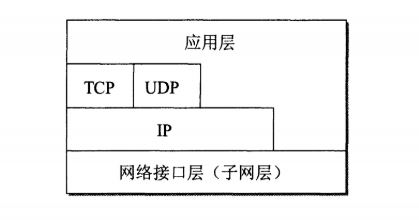
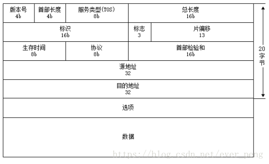

* [计算机网络体系结构](#%E8%AE%A1%E7%AE%97%E6%9C%BA%E7%BD%91%E7%BB%9C%E4%BD%93%E7%B3%BB%E7%BB%93%E6%9E%84)
  * [ARP](#arp)
  * [ICMP 协议](#icmp-%E5%8D%8F%E8%AE%AE)
  * [DHCP协议](#dhcp%E5%8D%8F%E8%AE%AE)
  * [路由选择协议](#%E8%B7%AF%E7%94%B1%E9%80%89%E6%8B%A9%E5%8D%8F%E8%AE%AE)
    * [RIP协议：（routing information protocol）距离向量算法](#rip%E5%8D%8F%E8%AE%AErouting-information-protocol%E8%B7%9D%E7%A6%BB%E5%90%91%E9%87%8F%E7%AE%97%E6%B3%95)
    * [OSPF协议：链路状态算法](#ospf%E5%8D%8F%E8%AE%AE%E9%93%BE%E8%B7%AF%E7%8A%B6%E6%80%81%E7%AE%97%E6%B3%95)
* [IP](#ip)
  * [ IP地址分类](#ip%E5%9C%B0%E5%9D%80%E5%88%86%E7%B1%BB)
  * [IP报文格式](#ip%E6%8A%A5%E6%96%87%E6%A0%BC%E5%BC%8F)

## 计算机网络体系结构

**五层协议**

**应用层：**
为特定应用程序提供数据传输服务，例如 HTTP、DNS 等。数据单位为报文。

**运输层：**
提供的是进程间的通用数据传输服务。由于应用层协议很多，定义通用的运输层协议就可以支持不断增多的应用层协议。运输层包括两种协议：传输控制协议
TCP，提供面向连接、可靠的数据传输服务，数据单位为报文段；用户数据报协议
UDP，提供无连接、尽最大努力的数据传输服务，数据单位为用户数据报。TCP
主要提供完整性服务，UDP 主要提供及时性服务。

**网络层：**
为主机间提供数据传输服务，而运输层协议是为主机中的进程提供服务。网络层把运输层传递下来的报文段或者用户数据报封装成分组。

**数据链路层**
：网络层针对的还是主机之间的数据传输服务，而主机之间可以有很多链路，链路层协议就是为同一链路的主机提供服务。数据链路层把网络层传下来的分组封装成帧。

**物理层**
：考虑的是怎样在传输媒体上传输数据比特流，而不是指具体的传输媒体。物理层的作用是尽可能屏蔽传输媒体和通信手段的差异，使数据链路层感觉不到这些差异。

**OSI**

其中表示层和会话层用途如下：

**表示层：**
数据压缩、加密以及数据描述，这使得应用程序不必担心在各台主机中数据内部格式不同的问题。

会话层 ：建立及管理会话。

五层协议没有表示层和会话层，而是将这些功能留给应用程序开发者处理。

**TCP/IP**

只有四层，相当于五层协议中数据链路层和物理层合并为网络接口层。TCP/IP
体系结构不严格遵循 OSI 分层概念，应用层可能会直接使用 IP 层或者网络接口层。

### ARP

[有了IP地址为什么还需要ARP协议](https://blog.csdn.net/u014805066/article/details/79682772)
ARP（地址解析协议，Address Resolution Protocol）是网络层协议。ARP 实现由 IP
地址得到 MAC
地址。每个主机都会在自己的ARP缓冲区中建立一个ARP列表，以表示IP地址和MAC地址之间的对应关系。

当源主机要发送数据时，首先检查ARP列表中是否有对应IP地址的目的主机的MAC地址，如果有，则直接发送数据，如果没有，就向本网段的所有主机发送ARP数据包，该数据包包括的内容有：源主机IP地址，源主机MAC地址，目的主机的IP地址。

当本网络的所有主机收到该ARP数据包时，首先检查数据包中的IP地址是否是自己的IP地址，如果不是，则忽略该数据包，如果是，则首先从数据包中取出源主机的IP和MAC地址写入到ARP列表中，如果已经存在，则覆盖，然后将自己的MAC地址写入ARP响应包中，告诉源主机自己是它想要找的MAC地址。

源主机收到ARP响应包后。将目的主机的IP和MAC地址写入ARP列表，并利用此信息发送数据。如果源主机一直没有收到ARP响应数据包，表示ARP查询失败。

**RARP协议：**
逆地址解析协议，作用是完成硬件地址到IP地址的映射，主要用于无盘工作站，因为给无盘工作站配置的IP地址不能保存

### ICMP 协议

ICMP是InternetControl Message Protocol，网际控制报文协。

ICMP是TCP/IP协议族的一个子协议，用于在IP主机、路由器之间传递控制消息。控制消息是指网络通不通、主机是否可达、路由器是否可用等网络本身的消息。这些控制消息虽然并不传输用户数据，但是对于用户数据的传递起着重要的作用。ICMP报文有两种：差错报告报文和询问报文。

**ICMP的应用**

Ping：测试两台主机之间的连通性。

Traceroute：跟踪一个分组从源点到终点的路径。

### DHCP协议

动态主机配置协议（Dynamic Host ConfigurationProtocol,
DHCP），是一种让系统得以连接到网络上，并获取所需要的配置参数手段。通常被应用在大型的局域网络环境中，主要作用是集中的管理、分配IP地址，使网络环境中的主机动态的获得IP地址、Gateway地址、DNS服务器地址等信息，并能够提升地址的使用率。

### 路由选择协议

**动态路由算法决定信息经过哪个路由器发送**。

#### RIP协议：（routing information protocol）距离向量算法

（1）以跳数作为度量，距离16表示不可达

（2）使用UDP的520端口发送和接收RIP分组

（3）RIP每隔30s以广播形式发送一次路由信息，在邻居之间互传，和邻居分享自己全部的信息，为了防止出现广播风暴，其后续的分组将做随机延时后发送。RIP协议规定，只和自己相邻的路由器交换信息，不相邻的路由器不交换信息。交换的信息是：“我到本自治系统中所有网络的最短距离，以及到每个网络应该经过的下一跳路由器”

（4）如果一个路由在180s内未被更新，相应的距离应设置为无穷大，并从路由表中删除该表项

（5）RIP分组分为请求分组 和响应分组 

（6）RIP选择一条具有最少路由器的路由，哪怕还存在另外一条高速但路由器较多的路由。

（7）RIP基于Bellman-Ford 算法

**过程分析：**在路由器刚启动的时候，启用了RIP的接口会向外广播请求信息，接下来RIP进程进入到一个循环状态：监听来自路由器的请求信息和应答信息。当邻居收到请求信息以后，就发送应答信息给这个发出请求信息的路由器。

平均每个30s，启用了RIP的接口会发送应答信息，也就是（updata），这个update包含了路由器完整的信息表。

#### OSPF协议：链路状态算法

OSPF协议：链路状态算法

（1）每个结点都有完整的网络拓扑信息

（2）一个结点检查所有直接链路的状态，并将所得的状态信息发送给网上所有其他的结点，故OSPF是将自己知道的部分信息告诉了所有结点，此处运用洪泛法

（3）只有当链路状态变化时，路由器才用洪泛法向所有路由器发送信息

（4）IP分装，协议号89

（5）支持IPV4和IPV6，支持组播

（6）死亡时间：40s

（7）OSPF基于迪杰斯特拉算法

注：OSPF克服了RIP的很多缺陷，表现在

（1）OSPF不再采用跳数的概念，而是根据接口的吞吐率，拥塞情况，往返时间等实际链路的负载能力定出路由的代价，同时选择最短，最优路由并允许保持到达同一目标地址的多条路由，从而平衡网络负荷

（2）OSPF支持不同服务类型的不同代价。

（3）OSPF路由器不再交换路由表，而是同步各路由器对于网络状态的认识，即链路状态数据库。

## IP

IP（Internet
Protocol的简写）地址，即用Internet协议语言表示的地址，用于在网络地址唯一地标识一台计算机。目前的IP版本有IPV4和IPV6。

**IP协议功能**

（1）寻址和路由；（根据对方的IP地址，寻找最佳路径传输信息）；

（2）传递服务：

①不可靠（IP协议只是尽自己最大努力去传输数据包），可靠性由上层协议提供（TCP协议）。

②无连接（事先不建立会话），不维护任何关于后续数据报的信息；

（3）数据包的分片和重组。

###  IP地址分类

A类地址，一个A类地址是由一个字节的网络地址和三个字节的主机地址组成，网络地址的最高位必须是“0”

B类地址，一个B类地址是由两个字节的网络地址和两个字节的主机地址组成，网络地址的最高位必须是“10”

C类地址，一个C类地址是由三个字节的网络地址和一个字节的主机地址组成，网络地址的最高位必须是“110”

D类地址，不区分网络地址和主机地址，D类地址是一种组播地址，D类地址的第一个字节以1110开始。目前D类地址被用在多点广播（Multicast）中。多点广播地址用来一次寻址一组计算机，它标识共享同一协议的一组计算机。

E类地址，不区分网络地址和主机地址，E类地址是保留地址用于以后使用。E类地址的第一个字节以1111开始。

**特殊IP地址**

(1)**0.0.0.0**
：严格说来，0.0.0.0已经不是一个真正意义上的IP地址了。它表示的是这样一个集合：所有不清楚的主机和目的网络。这里的“不清楚”是指在本机的路由表里没有特定条目指明如何到达。对本机来说，它就是一个“收容所”，所有不认识的“三无”人员，一律送进去。如果你在网络设置中设置了缺省网关，那么Windows系统会自动产生一个目的地址为0.0.0.0的缺省路由。

**(2)广播地址（255.255.255.255）:**
限制广播地址。对本机来说，这个地址指本网段内（同一广播域）的所有主机。如果翻译成人类的语言，应该是这样：“这个房间里的所有人都注意了！”这个地址不能被路由器转发。

**(3)环回地址（127.0.0.1）:**
本机地址，主要用于测试。用汉语表示，就是“我自己”。在Windows系统中，这个地址有一个别名“Localhost”。寻址这样一个地址，是不能把它发到网络接口的。除非出错，否则在传输介质上永远不应该出现目的地址为“127.0.0.1”的数据包。

(4)**165.254.x.x**:如果你的主机使用了DHCP功能自动获得一个IP地址，那么当你的DHCP服务器发生故障，或响应时间太长而超出了一个系统规定的时间，Wingdows系统会为你分配这样一个地址。

(5)**组播地址:**
组播地址，从224.0.0.0到239.255.255.254都是这样的地址。224.0.0.1特指所有主机，
224.0.0.2特指所有路由器。这样的地址多用于一些特定的程序以及多媒体程序。如果你的主机开启了IRDP（Internet路由发现协议，使用组播功能）功能，那么你的主机路由表中应该有这样一条路由，每个子网的第一个和最后一个地址无效。

(6)**私有地址:这**些地址不会被Internet分配，他们再Internet上也不会被路由，虽然它们不能直接和Internet网连接，但通过技术手段仍旧可以和
Internet通讯（NAT技术）。

A类地址的私有地址是：10.0.0.0\~10.255.255.255

B类地址的私有地址是：172.16.0.0\~172.31.255.255.255

C类地址的私有地址是：192.168.0.0\~192.168.255.255

**子网划分:**
通过在主机号字段中拿一部分作为子网号，把两级 IP 地址划分为三级 IP
地址。**IP 地址 ::= {\< 网络号 \>, \< 子网号 \>, \< 主机号
\>}。**要使用子网，必须配置子网掩码。一个 B 类地址的默认子网掩码为
255.255.0.0，如果 B 类地址的子网占两个比特，那么子网掩码为 11111111 11111111
11000000 00000000，也就是255.255.192.0。注意，外部网络看不到子网的存在。

**无分类:**
无分类编址 CIDR 消除了传统 A 类、B 类和 C
类地址以及划分子网的概念，使用网络前缀和主机号来对 IP
地址进行编码，网络前缀的长度可以根据需要变化。IP 地址 ::= {\< 网络前缀号 \>, \<
主机号 \>}。CIDR的记法上采用在 IP
地址后面加上网络前缀长度的方法，例如128.14.35.7/20表示前20位为网络前缀。CIDR的地址掩码可以继续称为子网掩码，子网掩码首1长度为网络前缀的长度。一个CIDR地址块中有很多地址，一个 CIDR表示的网络就可以表示原来的很多个网络，并且在路由表中只需要一个路由就可以代替原来的多个路由，减少了路由表项的数量。把这种通过使用网络前缀来减少路由表项的方式称为路由聚合，也称为构成超网。

### IP报文格式

**版本号：**
4个bit，用来标识IP版本号。这个4位字段的值设置为二进制的0100表示IPv4，设置为0110表示IPv6。目前使用的IP协议版本号是4。

**首部长度：**
4个bit。标识包括选项在内的IP头部字段的长度。

**服务类型：**
8个bit。服务类型字段被划分成两个子字段：3bit的优先级字段和4bitTOS字段，最后一位置为0。4bit的TOS分别代表：最小时延，最大吞吐量，最高可靠性和最小花费。4bit中只能将其中一个bit位置1。如果4个bit均为0，则代表一般服务。

**总长度：**
16个bit。接收者用IP数据报总长度减去IP报头长度就可以确定数据包数据有效负荷的大小。IP数据报最长可达65535字节。

**标识：**
16个bit。唯一的标识主机发送的每一份数据报。接收方根据分片中的标识字段是否相同来判断这些分片是否是同一个数据报的分片，从而进行分片的重组。通常每发送一份报文它的值就会加1。

**标志：**
3个bit。用于标识数据报是否分片。第1位没有使用，第2位是不分段（DF）位。当DF位被设置为1时，表示路由器不能对数据包进行分段处理。如果数据包由于不能分段而未能被转发，那么路由器将丢弃该数据包并向源发送ICMP不可达。第3位是分段（MF）位。当路由器对数据包进行分段时，除了最后一个分段的MF位被设置为0外，其他的分段的MF位均设置为1，以便接收者直到收到MF位为0的分片为止。

**片偏移：**
13个bit。在接收方进行数据报重组时用来标识分片的顺序。用于指明分段起始点相对于报头起始点的偏移量。由于分段到达时可能错序，所以位偏移字段可以使接收者按照正确的顺序重组数据包。当数据包的长度超过它所要去的那个数据链路的MTU时，路由器要将它分片。数据包中的数据将被分成小片，每一片被封装在独立的数据包中。接收端使用标识符，分段偏移以及标记域的MF位来进行重组。

**生存时间:**
8个bit。TTL域防止丢失的数据包在无休止的传播。该域包含一个8位整数，此数由产生数据包的主机设定。TTL值设置了数据报可以经过的最多的路由器数。TTL的初始值由源主机设置（通常为32或64），每经过一个处理它的路由器，TTL值减1。如果一台路由器将TTL减至0，它将丢弃该数据包并发送一个ICMP超时消息给数据包的源地址。

**协议：**
8个bit。用来标识是哪个协议向IP传送数据。ICMP为1，IGMP为2，TCP为6，UDP为17，GRE为47，ESP为50。

**首部检验和：**
根据IP首部计算的校验和码。

**源地址：**
IP报文发送端的IP地址

**目的地址：**
IP报文接收端的IP地址

**选项：**
是数据报中的一个可变长的可选信息。选项字段以32bit为界，不足时插入值为0的填充字节。保证IP首部始终是32bit的整数倍。
